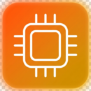
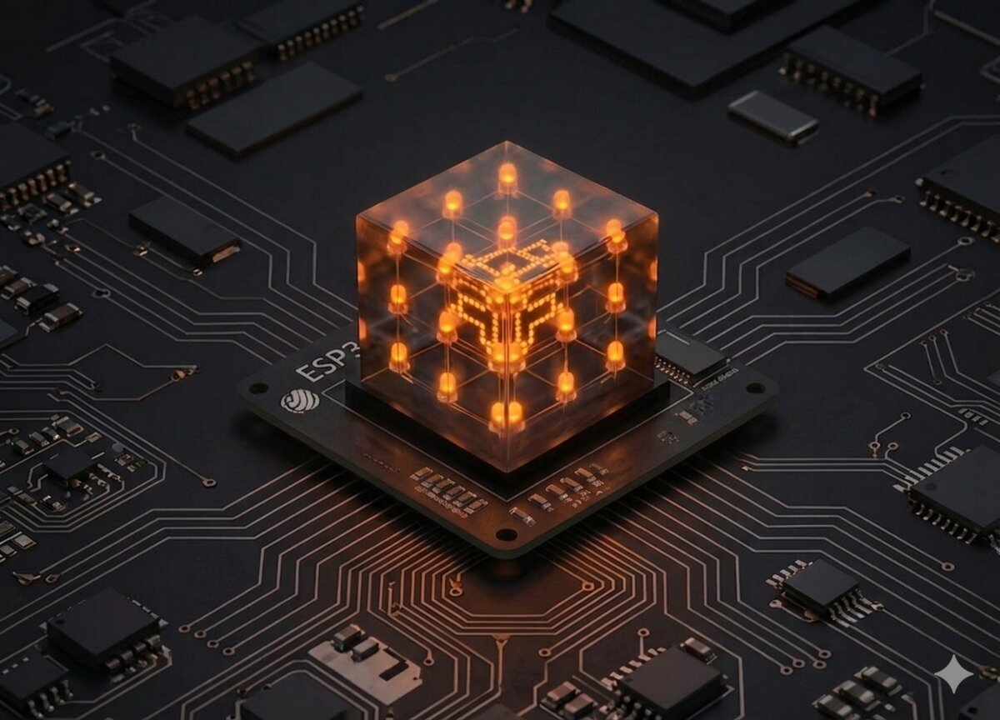

<div align="center">



# Ursoaia Edu Online

**Open-source computer-science circle — courses, projects, and electronics for curious students.**

[](https://ursoaia-edu.online)
[](LICENSE)
[](https://ursoaia-edu.online)
[](https://www.mkdocs.org/)
[](https://python.org)

[**Live site**](https://ursoaia-edu.online) · [Courses](https://ursoaia-edu.online/courses/) · [Projects](https://ursoaia-edu.online/projects/) · [Issues](https://github.com/ursoaia-edu/ursoaia-edu.online/issues)

</div>

<br />

<p align="center">
  
</p>

<br />

## About

We are a **student-run computer-science circle** exploring web development, Python, and electronics/IoT through real-world projects. All site content — lessons, wiring diagrams, source code, step-by-step tutorials — is open-source and available in both Romanian and English.

> Built for middle- and high-school students (ages 11–18), used weekly in the computer-science circle.

---

## What's inside

<table>
<tr>
<td width="50%" valign="top">

### Courses

| Course | Lessons | Key topics |
|--------|:-------:|-----------|
| [Web Development](docs/courses/web/) | **22** | HTML, CSS, JavaScript, Fetch, APIs |
| [Python](docs/courses/python/) | **12** | Variables, loops, functions, files, Turtle |

</td>
<td width="50%" valign="top">

### Hardware projects

| Platform | Projects | Tech |
|----------|:--------:|------|
| [Arduino](docs/projects/arduino/) | 2 | C/C++, LED multiplexing |
| [ESP32](docs/projects/esp32/) | 3 | MicroPython, Wi-Fi, DHT |
| [LoPy](docs/projects/lopy/) | 1 | LoRaWAN, ABP |
| [Raspberry Pi](docs/projects/raspberry_pi/) | — | Pi Pico, C, MicroPython |

</td>
</tr>
</table>

### Stats

|  |  |
|---|---|
| **35** complete lessons | **6+** hardware projects |
| **2** languages (RO + EN) | **4** hardware platforms |
| **3** web capstone projects | **100%** open-source |

---

## Run the site locally

Requirements: **Python 3.12+** and [`uv`](https://docs.astral.sh/uv/) for dependency management.

```bash
# Clone the repo
git clone git@github.com:ursoaia-edu/ursoaia-edu.online.git
cd ursoaia-edu.online

# Install dependencies (creates .venv automatically)
uv sync

# Start the dev server with live reload
uv run serve
# → http://127.0.0.1:8000

# Or build the static site into ./site
uv run build

# Strict build (fails on warnings — used in CI)
uv run build --strict
```

---

## Tech stack

- **[MkDocs](https://www.mkdocs.org/)** — static site generator
- **[mkdocs-static-i18n](https://github.com/ultrabug/mkdocs-static-i18n)** — RO + EN internationalization
- **[Tailwind CSS](https://tailwindcss.com/)** + **[Lucide icons](https://lucide.dev/)** — styling and icons (via CDN)
- **Custom theme** — Jinja2 templates in `custom_theme/`, no prebuilt MkDocs theme
- **[uv](https://docs.astral.sh/uv/)** — fast Python toolchain

---

## Repo structure

```
.
├── docs/                        # all site content
│   ├── index.md / index.en.md   # homepage (RO / EN)
│   ├── assets/
│   │   ├── logo.png             # logo, favicons
│   │   └── images/              # lesson images, schematics, project photos
│   ├── courses/                 # courses
│   │   ├── index.md             # overview page (Web + Python cards)
│   │   ├── web/                 # 22 HTML+CSS+JS lessons
│   │   └── python/              # 12 lessons
│   └── projects/                # hardware projects
│       ├── index.md             # overview page
│       ├── arduino/
│       ├── esp32/
│       ├── lopy/
│       └── raspberry_pi/
├── custom_theme/                # custom MkDocs templates
│   ├── base.html                # HTML shell, nav, language switcher
│   └── main.html                # homepage + inner page layouts
├── mkdocs.yml                   # main configuration
├── pyproject.toml               # Python dependencies (uv)
├── LICENSE                      # MIT + CC BY 4.0
└── README.md
```

---

## Contributing

Contributions are welcome! Concrete ideas:

- **Corrections** to lessons — typos, broken examples, unclear explanations
- **New projects** — Arduino, ESP32, LoPy, Raspberry Pi, or other platforms
- **New lessons** — improvements or extensions to existing courses
- **Translations** — improvements to the EN version or new languages
- **Design** — UI/UX suggestions for the site

```bash
# Fork → branch → commit → PR
git checkout -b feature/your-name
# make changes
uv run build --strict   # verify everything builds
git commit -m "feat: short description"
git push origin feature/your-name
# open a Pull Request on GitHub
```

Or open an [issue](https://github.com/ursoaia-edu/ursoaia-edu.online/issues) with an idea.

---

## License

This project is **dual-licensed** — see [`LICENSE`](LICENSE) for details.

| Material | License |
|----------|---------|
| Code (templates, scripts, examples) | **[MIT](LICENSE)** |
| Educational content (lessons, schematics, exercises) | **[CC BY 4.0](https://creativecommons.org/licenses/by/4.0/)** |

You may freely use, modify, and redistribute, with attribution.

---

## Acknowledgments

- **[Arduino](https://arduino.cc)**, **[Espressif](https://espressif.com)**, **[Pycom](https://pycom.io)**, **[Raspberry Pi Foundation](https://raspberrypi.com)** — accessible hardware
- **[Open-Meteo](https://open-meteo.com)** — free weather API used in the Web course
- **[Thonny](https://thonny.org)** — Python IDE built for beginners
- The **MkDocs community** and contributors to its i18n and theme tooling
- All **students and mentors** who contribute to the circle

---

<div align="center">

Built by the **Ursoaia** computer-science circle &middot; Live site: [ursoaia-edu.online](https://ursoaia-edu.online)

</div>
