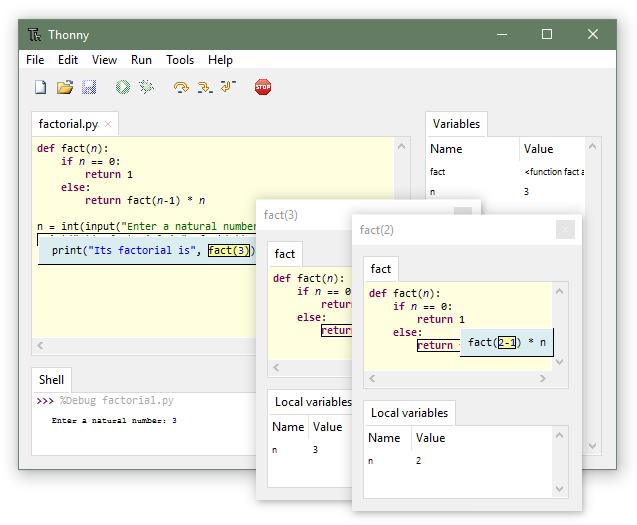

# Lesson 00 · Getting started

!!! tip "What you'll learn"
    - What Python is and what it's used for
    - How to install and use the Thonny IDE
    - How to write and run your first Python program
    - How to read an error message

---

## What is Python?


**Python** is a programming language created in 1991 by Guido van Rossum. Today it is one of the most popular languages in the world — and for good reasons:

- It reads almost like plain English
- It works on Windows, macOS, and Linux
- It is used for **games**, **artificial intelligence**, **websites**, **data analysis**, **robotics**

!!! note "Python is free"
    Python is open-source. You can download, use, and distribute it without any restrictions.

---

## Our tool: Thonny

**Thonny** is a code editor created specifically for learning Python. It is simple, has a visual debugger, and comes with Python already included.

### Installation

1. Go to [https://thonny.org](https://thonny.org)
2. Download the version for your system (Windows / macOS / Linux)
3. Run the installer — all default settings are fine
4. Open Thonny

!!! tip "Online alternative"
    If you can't install programs, use [repl.it](https://repl.it) — create a free account and run Python directly in the browser.

### What Thonny looks like



The interface is split into two main areas:

- **The Editor** (top) — where you write programs
- **The Shell** (bottom) — where results appear when you run code

---

## Your first program

### 1. Write the code

In the Thonny editor, type exactly:

```python
print("Hello, world!")
```

### 2. Run

Press the **▶ Run** button or the `F5` key.

### 3. Look at the result

```
Hello, world!
```

Congratulations — you've written your first Python program!

---

## The `print()` function

`print()` is a **function** — a ready-made block of code that does something. In this case, it displays text on the screen.

The text goes between **quotes** (single `'` or double `"`) and **inside parentheses**:

```python
print("Python is fun!")
print('And I can program too.')
print("Ursoaia Edu Online")
```

Each `print()` displays a new line.

---

## Reading errors

Mistakes are normal and inevitable. Here's an example:

```python
print("Hello, world!"
```

Python will display:

```
SyntaxError: '(' was never closed
```

**Translation:** the `(` parenthesis was never closed.

**Fix:** add `)` at the end.

!!! warning "Errors are your friends"
    Every error tells you exactly what went wrong and on which line. Read the message carefully before changing the code.

---

## The interactive shell

In the bottom area of Thonny you can test Python commands directly, without saving a file:

```python
>>> 2 + 3
5
>>> "Anna" + " has " + "apples"
'Anna has apples'
```

`>>>` means Python is waiting for a command. Ideal for quickly testing ideas.

---

## Exercises

### Exercise 1 — Three things about you
Write a program that displays your name, age, and home town, each on a separate line.

??? success "Solution"
    ```python
    print("Mary")
    print(14)
    print("Timișoara")
    ```

### Exercise 2 — How many lines?
How many lines will the following program display?

```python
print("One")
print("Two")
print("Three")
```

??? success "Answer"
    **3 lines.** Each `print()` produces a new line.

### Exercise 3 — Find the error
What's wrong?

```python
print("Good day!
```

??? success "Answer"
    The closing quote `"` and closing parenthesis `)` are missing.
    ```python
    print("Good day!")
    ```

---

## Mini-project: Your business card

Write a program that displays a business card with information about you.

**Example output:**
```
==============================
  My name: Mary Ionescu
  Age: 14 years
  School: Theoretical High School X
  Hobbies: programming, soccer
==============================
```

??? success "Solution"
    ```python
    print("==============================")
    print("  My name: Mary Ionescu")
    print("  Age: 14 years")
    print("  School: Theoretical High School X")
    print("  Hobbies: programming, soccer")
    print("==============================")
    ```
    Edit it with your real information!

---

## Summary

- Python is a simple and powerful programming language
- Thonny is our recommended editor for writing code
- `print()` displays text on the screen
- Errors are normal — read the message and fix it

---

**Next step:** [→ Lesson 01: Variables and data types](01-variabile-si-tipuri.md)
