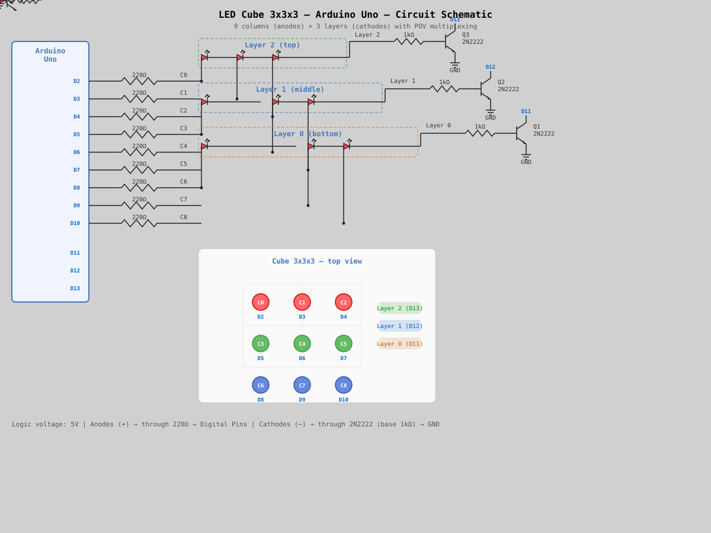

# 3x3x3 LED Cube

A simplified version of the [8x8x8 LED Cube](https://www.instructables.com/8x8x8-Arduino-LED-Cube/) project, adapted for beginners.

## How It Works

The cube uses **layer multiplexing**:

- **9 columns** (LED anodes) are connected to Arduino digital pins through 220 Ω resistors.
- **3 layers** (LED cathodes) are controlled via NPN transistors (2N2222 / BC547).
- Arduino rapidly switches layers (POV — persistence of vision), creating the illusion that all 27 LEDs are lit simultaneously.

```
     Top view (column numbering):

         C0   C1   C2
         C3   C4   C5
         C6   C7   C8

     Layers (side view):
         Layer 2 (top)
         Layer 1 (middle)
         Layer 0 (bottom)
```

## Bill of Materials

| Component                | Quantity   | Notes                          |
|--------------------------|------------|--------------------------------|
| Arduino Uno (CH340)      | 1          | Or Nano                        |
| LED 5mm (any color)      | 27         | Can use 3 colors, 9 each      |
| 220 Ω resistor           | 9          | Current-limiting (columns)     |
| 1 kΩ resistor            | 3          | For transistor bases (layers)  |
| NPN transistor 2N2222    | 3          | Or BC547/BC337                 |
| Breadboard               | 1          | 830 tie-points                 |
| Jumper wires             | ~20        | M-M                           |

> All components are included in the **LA036 Super Starter Kit for Arduino UNO**.

## Wiring Diagram



```
                        Arduino Uno
                     ┌──────────────────┐
                     │                  │
    Columns          │  D2  ──[220Ω]──── C0 (LED anode)
    (anodes)         │  D3  ──[220Ω]──── C1
                     │  D4  ──[220Ω]──── C2
                     │  D5  ──[220Ω]──── C3
                     │  D6  ──[220Ω]──── C4
                     │  D7  ──[220Ω]──── C5
                     │  D8  ──[220Ω]──── C6
                     │  D9  ──[220Ω]──── C7
                     │  D10 ──[220Ω]──── C8
                     │                  │
    Layers           │  D11 ──[1kΩ]──┐  │
    (cathodes         │  D12 ──[1kΩ]──┤  │
     via               │  D13 ──[1kΩ]──┤  │
     transistors)    │                │  │
                     │  GND ──────────┘  │
                     └──────────────────┘

    2N2222 transistor (for each layer):

        Arduino Pin ──[1kΩ]──► Base
                               Collector ◄── Layer cathodes (all 9 LEDs)
                               Emitter ──► GND
```

### Pin Assignment

| Arduino Pin | Function             |
|-------------|----------------------|
| D2          | Column 0 (anode)     |
| D3          | Column 1             |
| D4          | Column 2             |
| D5          | Column 3             |
| D6          | Column 4             |
| D7          | Column 5             |
| D8          | Column 6             |
| D9          | Column 7             |
| D10         | Column 8             |
| D11         | Layer 0 (bottom)     |
| D12         | Layer 1 (middle)     |
| D13         | Layer 2 (top)        |
| GND         | Transistor emitters  |

## Building the Cube

### 1. Preparing the LEDs
- Test each LED before soldering (with a 220 Ω resistor from 5V).
- Identify polarity: long leg = anode (+), short leg = cathode (−).
- Bend the cathode (−) of each LED at 90° — they will be connected horizontally to form a layer.

### 2. Making a Jig
- Draw a 3×3 grid on cardboard or plywood with ~20 mm spacing between centers.
- Drill 9 holes with a 5 mm diameter.

### 3. Soldering the Layers
- Insert 9 LEDs into the jig.
- Solder all cathodes (−) into a horizontal grid using copper wire.
- Repeat for all 3 layers. Test each layer!

### 4. Connecting the Columns
- Place the bottom layer on the breadboard.
- Solder the middle layer on top, connecting anodes (+) vertically.
- Solder the top layer.
- Use spacers of equal height between layers (~20 mm).

### 5. Connecting to Arduino
- 9 anodes (columns) → through 220 Ω resistors → pins D2–D10.
- 3 cathode layers → through 2N2222 transistors → pins D11–D13.

## Code

```cpp
/*
 * 3x3x3 LED Cube — Arduino Uno
 */

// === Pin configuration ===
const byte COL_PINS[9] = {2, 3, 4, 5, 6, 7, 8, 9, 10};
const byte LAYER_PINS[3] = {11, 12, 13};

#define NUM_LAYERS  3
#define NUM_COLS    9

uint16_t cube[NUM_LAYERS];
#define POV_DELAY 3

void displayCube() {
  for (byte layer = 0; layer < NUM_LAYERS; layer++) {
    for (byte l = 0; l < NUM_LAYERS; l++) digitalWrite(LAYER_PINS[l], LOW);
    for (byte col = 0; col < NUM_COLS; col++) digitalWrite(COL_PINS[col], (cube[layer] >> col) & 1);
    digitalWrite(LAYER_PINS[layer], HIGH);
    delay(POV_DELAY);
  }
  for (byte l = 0; l < NUM_LAYERS; l++) digitalWrite(LAYER_PINS[l], LOW);
}

void showFor(unsigned long duration) {
  unsigned long start = millis();
  while (millis() - start < duration) displayCube();
}

void clearCube() {
  for (byte i = 0; i < NUM_LAYERS; i++) cube[i] = 0;
}

void fillCube() {
  for (byte i = 0; i < NUM_LAYERS; i++) cube[i] = 0b111111111;
}

void setLed(byte x, byte y, byte z, bool state) {
  byte col = y * 3 + x;
  if (state) cube[z] |= (1 << col);
  else cube[z] &= ~(1 << col);
}

// Animations omitted for brevity in this snippet, 
// but you can add your own!
// See full code for details.

void setup() {
  for (byte i = 0; i < NUM_COLS; i++) {
    pinMode(COL_PINS[i], OUTPUT);
    digitalWrite(COL_PINS[i], LOW);
  }
  for (byte i = 0; i < NUM_LAYERS; i++) {
    pinMode(LAYER_PINS[i], OUTPUT);
    digitalWrite(LAYER_PINS[i], LOW);
  }
  randomSeed(analogRead(A0));
  clearCube();
}

void loop() {
  fillCube();
  showFor(1000);
  clearCube();
  showFor(500);
}
```

## References

- [Original 8x8x8 project](https://www.instructables.com/8x8x8-Arduino-LED-Cube/)
- [Arduino Forum: Simple 3x3x3 cube](https://forum.arduino.cc/t/very-simple-3x3x3-cube-sketch/922655)
- [Instructables: 3x3x3 LED Cube Arduino-UNO](https://www.instructables.com/3x3x3-LED-Cube-Arduino-UNO/)
