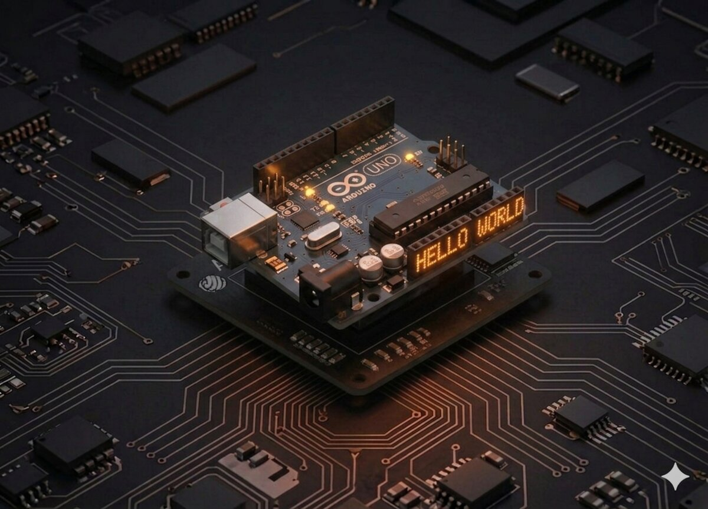

# Proiect 01 — Hello World

Acesta este primul pas în lumea Arduino. Nu ai nevoie de nicio componentă în afară de placă și cablul USB. Vei învăța cum se face comunicarea serială între Arduino și calculator și vei folosi pentru prima dată **Serial Monitor**-ul din Arduino IDE.



## Componente necesare

| Componentă | Cantitate |
|------------|-----------|
| Arduino Uno R3 (CH340) | 1 |
| Cablu USB A–B | 1 |

!!! info "Niciun fir suplimentar"
    Pentru acest proiect nu ai nevoie de breadboard, rezistențe sau LED-uri externe — folosim **LED-ul integrat** de pe placă (pinul 13).

---

## Cum funcționează

Arduino comunică cu calculatorul prin cablul USB folosind un protocol numit **UART** (comunicare serială asincronă). Sub capotă, USB-ul încapsulează această comunicare serială prin chip-ul **CH340** de pe placa noastră.

În Arduino IDE există o fereastră specială — **Serial Monitor** — care:

- afișează mesajele primite de la placă
- îți permite să trimiți date (text, comenzi) către placă

În acest proiect:

1. Tu trimiți litera `A` prin Serial Monitor.
2. Arduino primește caracterul, aprinde LED-ul de pe pinul 13 pentru o jumătate de secundă.
3. Arduino răspunde cu textul `Hello World!`.

!!! warning "Atenție la baud rate"
    **Baud rate** = viteza de comunicare (cifre pe secundă). Trebuie să fie **identică** pe Arduino (`Serial.begin(9600)`) și în Serial Monitor (selector dreapta-jos). Dacă nu se potrivesc, vezi caractere ciudate.

---

## Conectare

```board
   ┌──────────────┐                        ┌──────────────┐
   │              │                        │              │
   │  Arduino Uno │ ═══ cablu USB A–B ═══  │   PC/Laptop  │
   │              │                        │              │
   │   ● LED 13   │                        └──────────────┘
   │   (integrat) │
   └──────────────┘
```

Comunicarea serială folosește pinii `0 (RX)` și `1 (TX)`, dar ei sunt rutați automat prin USB — **nu** trebuie să conectezi nimic suplimentar.

---

## Cod

```cpp
/*
 * Proiect 1 — Hello World
 * Trimite "Hello World!" când primește caracterul 'A' prin Serial.
 */

const int LED_PIN = 13;     // LED-ul integrat pe placa Arduino

void setup() {
  Serial.begin(9600);       // Pornim comunicarea serială la 9600 baud
  pinMode(LED_PIN, OUTPUT); // Pinul 13 este ieșire (output)
}

void loop() {
  // Verificăm dacă există date primite prin portul serial
  if (Serial.available()) {
    char c = Serial.read();

    // Dacă este litera 'A' (majusculă)
    if (c == 'A') {
      digitalWrite(LED_PIN, HIGH);
      delay(500);
      digitalWrite(LED_PIN, LOW);
      delay(500);
      Serial.println("Hello World!");
    }
  }
}
```

### Pașii pentru a rula

1. Deschide **Arduino IDE** și lipește codul de mai sus.
2. **Tools → Board** → alege „Arduino Uno".
3. **Tools → Port** → alege port-ul COM pe care apare placa (ex. `COM3` pe Windows, `/dev/ttyUSB0` pe Linux).
4. Apasă **Upload** (săgeata →).
5. După ce vezi `Done uploading`, apasă pictograma **Serial Monitor** (lupa, dreapta-sus).
6. În colțul dreapta-jos al Serial Monitor, setează baud rate-ul la **9600**.
7. Tastează `A` în câmpul de sus și apasă **Send**.

---

## Ce să încerci

- **Mesaj personalizat** — schimbă `"Hello World!"` în `"Salut, lume!"` sau numele tău.
- **Clipire multiplă** — folosește `for (int i = 0; i < 3; i++) { ... }` ca LED-ul să clipească de 3 ori la fiecare apăsare de `A`.
- **Mai multe comenzi** — adaugă o ramură `else if (c == 'B')` care răspunde cu altceva.
- **Baud rate mai rapid** — schimbă `9600` în `115200` (atât în cod cât și în Serial Monitor) și observă diferența.

---

## Note de depanare

!!! tip "Nu vezi nimic în Serial Monitor"
    - Verifică portul COM din **Tools → Port** — trebuie să fie cel pe care apare placa
    - Verifică baud rate-ul (`9600` în cod și în Serial Monitor)
    - Asigură-te că ai apăsat **Upload** după ce ai modificat codul

!!! tip "Driver CH340"
    Placa noastră are chip-ul **CH340** pentru USB-Serial. Dacă Windows nu o detectează, instalează driver-ul de la [wch.cn](http://www.wch-ic.com/downloads/CH341SER_EXE.html).

---

**→ Următorul proiect:** [02 — LED intermitent](02-led-blinking.md) · [Toate proiectele kit-ului](kits.md)
