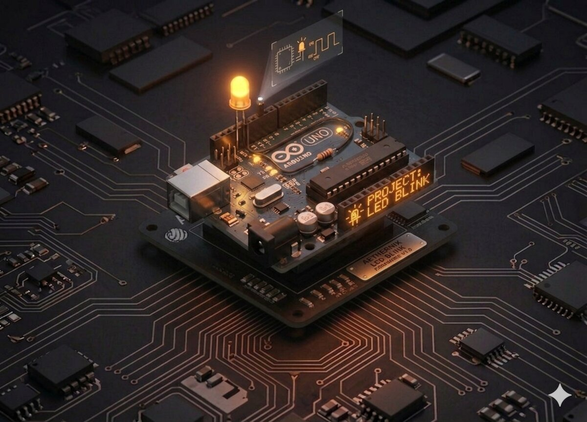

# LED intermitent

După ce ai trimis "Hello World!" prin cablu, este timpul să scoți primul LED pe breadboard. Vei conecta un LED la un pin digital extern (nu LED-ul integrat) și îl vei face să clipească.



## Componente necesare

| Componentă | Cantitate |
|------------|-----------|
| Arduino Uno R3 | 1 |
| Breadboard 830 puncte | 1 |
| LED roșu 5 mm | 1 |
| Rezistență 220 Ω | 1 |
| Fire jumper M-M | 2 |

## Cum funcționează

Un **LED** (Light Emitting Diode) este o diodă care emite lumină atunci când curentul trece prin ea în direcția corectă. Are două picioare:

- **Anodul (+)** — piciorul mai lung, se conectează la pinul digital.
- **Catodul (−)** — piciorul mai scurt, cu latură plată pe carcasă, se conectează la GND.

**Rezistența de 220 Ω** este obligatorie: fără ea, prin LED ar trece prea mult curent și s-ar arde aproape instantaneu. Rezistența "sugrumă" curentul la o valoare sigură (~15 mA pentru un LED roșu la 5 V).

**Breadboard**-ul îți permite să construiești circuite fără lipire. Rândurile scurte sunt conectate electric între ele, iar coloanele lungi de pe margini sunt folosite pentru alimentare (`+` și `GND`).

În cod vom alterna periodic starea pinului 10 între `HIGH` (5 V, LED aprins) și `LOW` (0 V, LED stins), cu o pauză de o secundă între schimbări.

## Conectare

| Componentă | Arduino / Breadboard |
|-----------|----------------------|
| Anodul (+) LED | pin D10 prin rezistență 220 Ω |
| Catodul (−) LED | GND |

```board
   Arduino Uno                      Breadboard
   ┌─────────┐
   │     D10 │────[220 Ω]────┬─── Anod (+) LED
   │         │               │
   │     GND │───────────────┴─── Catod (−) LED
   └─────────┘
```

## Cod

```cpp
/*
 * Proiect 2 — LED intermitent
 * Face un LED să clipească la fiecare secundă.
 */

int ledPin = 10;

void setup() {
  pinMode(ledPin, OUTPUT);   // Pinul 10 ca ieșire digitală
}

void loop() {
  digitalWrite(ledPin, HIGH); // LED aprins
  delay(1000);                // Așteaptă 1 secundă
  digitalWrite(ledPin, LOW);  // LED stins
  delay(1000);                // Așteaptă 1 secundă
}
```

## Ce să încerci

- Schimbă intervalul la 200 ms — LED-ul va clipi rapid.
- Conectează **două LED-uri** pe pini diferiți și fă-le să clipească alternativ.
- Fă un "SOS" în cod Morse (`... --- ...`).
- Înlocuiește `delay()` cu `millis()` pentru a nu bloca execuția.

## Note

- Dacă LED-ul nu se aprinde, verifică **polaritatea** (piciorul lung = +).
- Nu conecta LED-ul **fără rezistență** — îl vei distruge.
- Orice pin digital poate fi folosit (`D2`–`D13`).

---

**Vezi și:** [Toate proiectele kit-ului](kits.md)
