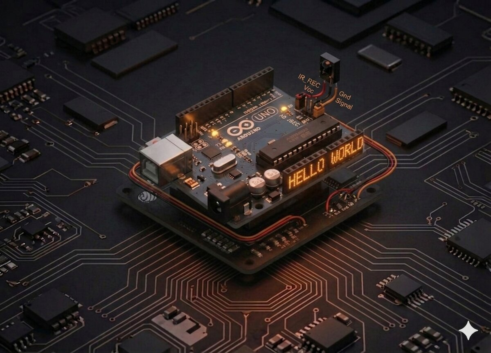

# Receptor IR (telecomandă)

Fiecare televizor, DVD player sau aparat de aer condiționat are un senzor IR în față. În acest proiect înveți cum funcționează el și cum să folosești o telecomandă ca intrare pentru Arduino.



## Componente necesare

| Componentă | Cantitate |
|------------|-----------|
| Arduino Uno R3 | 1 |
| Receptor IR (3 pini) | 1 |
| Telecomandă IR | 1 |
| Fire jumper F-M | 3 |

## Cum funcționează

**Lumina infraroșie (IR)** are lungimea de undă în jurul a **940 nm** — invizibilă pentru ochiul uman, dar perfectă pentru transmiterea de date pe distanțe scurte.

### Cum comunică telecomanda

Telecomanda nu trimite doar "lumină", ci o **lumină modulată** la **38 kHz** — adică clipește foarte rapid. Senzorul IR are un demodulator intern care filtrează doar semnalele la 38 kHz și ignoră lumina ambientală.

Când apeși un buton, telecomanda emite o **secvență unică de biți** (un cod hexazecimal) care identifică butonul. Receptorul o decodează și o livrează la Arduino ca un număr, de exemplu `0xFF18E7` pentru butonul "SUS".

### Pinii receptorului
Receptorul IR are 3 picioare (privind de sus, cu bula la tine):
- **S (Signal)** — semnal
- **VCC (mijloc)** — 5 V
- **GND** — masă

## Conectare

| Pin senzor | Arduino |
|-----------|---------|
| S | D11 |
| VCC (mijloc) | 5V |
| GND | GND |

```board
    Arduino                IR Receiver
     D11  ──────────────── S (semnal)
     5V   ──────────────── VCC (mijloc)
     GND  ──────────────── GND
```

## Cod

```cpp
/*
 * Proiect 12 — Receptor IR
 * Afișează codul fiecărui buton apăsat pe telecomandă.
 * Bibliotecă necesară: IRremote (v3+).
 */

#include <IRremote.h>

int IR_RECV_PIN = 11;

void setup() {
  Serial.begin(9600);
  IrReceiver.begin(IR_RECV_PIN, ENABLE_LED_FEEDBACK);
}

void loop() {
  if (IrReceiver.decode()) {
    // Afișează codul primit
    Serial.print("Cod buton: 0x");
    Serial.println(IrReceiver.decodedIRData.command, HEX);
    IrReceiver.resume(); // pregătește-te pentru următorul semnal
  }
}
```

## Ce să încerci

- Atribuie comenzi butoanelor (ex: butonul 1 → aprinde LED, 2 → stinge).
- Controlează un **servo** (Proiect 8) cu săgețile stânga/dreapta.
- Pornește o **melodie** (Proiect 7) la un buton anume.
- Construiește o telecomandă universală pentru un mini-proiect.

## Note

- Trebuie instalată biblioteca **`IRremote`** din Arduino Library Manager.
- Dacă folosești v2 a bibliotecii, sintaxa este diferită (`IRrecv` + `decode_results`).
- Codurile hexa depind de **model** — rulează codul o dată și notează-ți codurile fiecărui buton.
- Unele biblioteci vechi (`RobotIRremote`) intră în conflict — scoate-le din folderul de biblioteci.

---

**Vezi și:** [Toate proiectele kit-ului](kits.md)
