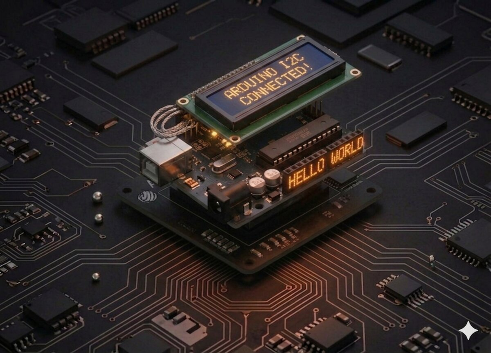

# Afișaj LCD1602 cu I2C

Ecranele LCD sunt modul cel mai simplu de a afișa text în proiectele Arduino. Versiunea cu **modul I2C** folosește doar 2 fire de date, eliberând pinii pentru alți senzori.



## Componente necesare

| Componentă | Cantitate |
|------------|-----------|
| Arduino Uno R3 | 1 |
| Modul LCD1602 cu interfață I2C | 1 |
| Breadboard 830 puncte | 1 |
| Fire jumper M-F | 4 |

## Cum funcționează

### LCD 1602

"1602" înseamnă **16 caractere pe 2 rânduri**. Fiecare caracter este format dintr-o matrice de 5×8 puncte, iar ecranul are iluminare din spate (backlight) pentru vizibilitate bună.

### De ce I2C?

Un LCD 1602 normal are **16 pini** și are nevoie de **6–11 fire** până la Arduino. Cu un **modul I2C** atașat în spate (un mic PCB), ai nevoie de doar **4 fire**: VCC, GND, SDA, SCL.

**I2C** (Inter-Integrated Circuit) este un protocol de comunicație în care mai multe dispozitive pot partaja aceeași magistrală de 2 fire. Fiecare dispozitiv are o **adresă** unică — pentru modulul nostru, de obicei `0x27` sau `0x3F`.

Pe Arduino Uno, pinii I2C sunt:
- **SDA** (date) → pinul **A4**
- **SCL** (ceas) → pinul **A5**

## Conectare

| Pin modul I2C | Arduino |
|-----------|---------|
| VCC | 5V |
| GND | GND |
| SDA | A4 |
| SCL | A5 |

```board
    Arduino              LCD1602 I2C
     5V   ──────────── VCC
     GND  ──────────── GND
     A4   ──────────── SDA
     A5   ──────────── SCL
```

## Cod

```cpp
/*
 * Proiect 14 — LCD1602 I2C
 * Afișează două rânduri de text.
 * Bibliotecă: LiquidCrystal_I2C
 */

#include <Wire.h>
#include <LiquidCrystal_I2C.h>

// Adresa 0x27, 16 coloane, 2 rânduri
LiquidCrystal_I2C lcd(0x27, 16, 2);

void setup() {
  lcd.init();         // inițializează LCD-ul
  lcd.backlight();    // pornește lumina de fundal

  lcd.setCursor(0, 0);
  lcd.print("Hello, world!");
  lcd.setCursor(0, 1);
  lcd.print("Ursoaia Edu");
}

void loop() {
  // Nimic; textul rămâne afișat.
}
```

## Ce să încerci

- Afișează un **contor** incrementat la fiecare secundă.
- Afișează **distanța** măsurată de senzorul ultrasonic (Proiect 10).
- Afișează **temperatura** (Proiect 15) cu icoană termometru custom.
- Fă un text care **se derulează** (scroll) pe ecran.

## Note

- Trebuie instalată biblioteca **`LiquidCrystal_I2C`** (de Frank de Brabander sau Marco Schwartz).
- **Dacă nu vezi nimic**: ajustează potențiometrul albastru din spatele modulului — reglează contrastul.
- Dacă adresa `0x27` nu merge, încearcă `0x3F`. Poți scana adresele cu sketch-ul **I2C Scanner**.
- Pinii A4 și A5 nu mai pot fi folosiți pentru citiri analogice când I2C este activ.

---

**Vezi și:** [Toate proiectele kit-ului](kits.md)
