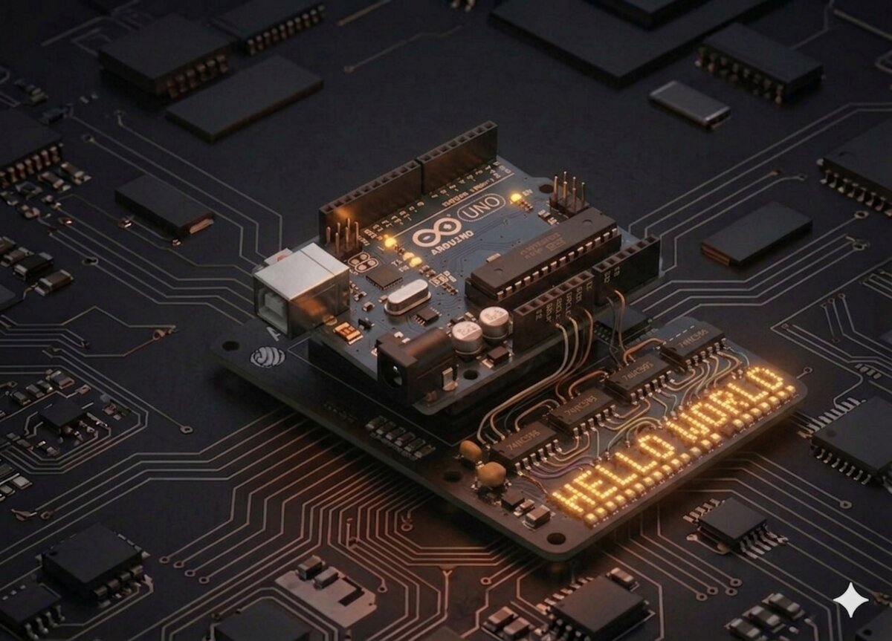

# Opt LED-uri cu 74HC595

Cum controlezi 8 LED-uri folosind doar 3 pini Arduino? Răspunsul: **registrul de deplasare 74HC595**, un cip magic care transformă comunicația serială în 8 ieșiri paralele.



## Componente necesare

| Componentă | Cantitate |
|------------|-----------|
| Arduino Uno R3 | 1 |
| Breadboard 830 puncte | 1 |
| LED (orice culoare) | 8 |
| Rezistență 220 Ω | 8 |
| 74HC595 IC | 1 |
| Fire jumper M-M | 14 |

## Cum funcționează

Registrul de deplasare are **8 "celule de memorie"** intern. Îi dai datele **bit cu bit** prin pinul de date, la comanda unui pin de ceas. După ce ai împins 8 biți, activezi pinul "latch" care copiază toți biții pe ieșirile paralele **Q0..Q7**.

### Pini 74HC595

| Pin | Rol |
|-----|-----|
| Q0..Q7 | Ieșiri paralele (la LED-uri) |
| DS (14) | Data Serial — intrarea de date |
| SH_CP (11) | Shift Clock — ceasul |
| ST_CP (12) | Storage / Latch |
| MR (10) | Master Reset (la VCC) |
| OE (13) | Output Enable (la GND) |
| VCC (16) | +5 V |
| GND (8) | masă |

### Funcția `shiftOut()`

Arduino are o funcție nativă pentru a trimite un byte:
```cpp
shiftOut(dataPin, clockPin, LSBFIRST, leds);
```
Trimite 8 biți pe rând către cip. Fiecare bit corespunde unui LED.

## Conectare

| 74HC595 | Arduino / Alt component |
|---------|------------------------|
| Pin 14 (DS) | D12 |
| Pin 12 (ST_CP, latch) | D11 |
| Pin 11 (SH_CP, clock) | D9 |
| Pin 16 (VCC) | 5V |
| Pin 10 (MR) | 5V |
| Pin 13 (OE) | GND |
| Pin 8 (GND) | GND |
| Q0..Q7 | prin 220 Ω la fiecare LED, LED-urile la GND |

## Cod

```cpp
/*
 * Proiect 16 — 8 LED-uri cu 74HC595
 * Aprinde LED-urile pe rând, apoi le stinge.
 */

int latchPin = 11;
int clockPin = 9;
int dataPin = 12;

byte leds = 0;

void updateShiftRegister() {
  digitalWrite(latchPin, LOW);
  shiftOut(dataPin, clockPin, LSBFIRST, leds);
  digitalWrite(latchPin, HIGH);
}

void setup() {
  pinMode(latchPin, OUTPUT);
  pinMode(dataPin, OUTPUT);
  pinMode(clockPin, OUTPUT);
}

void loop() {
  leds = 0;
  updateShiftRegister();
  delay(500);

  for (int i = 0; i < 8; i++) {
    bitSet(leds, i);       // setează bit-ul i la 1
    updateShiftRegister();
    delay(500);
  }
}
```

## Ce să încerci

- Afișează un **număr binar** (0–255) pe cele 8 LED-uri.
- Fă o **cursă Larson** (Knight Rider) — un LED care se mișcă stânga-dreapta.
- Adaugă un **al doilea 74HC595** în cascadă și comandă 16 LED-uri cu aceiași 3 pini.
- Fă un **VU-meter** care răspunde la senzorul de sunet (Proiect 25).

## Note

- Pinul **OE (13)** trebuie la GND pentru ca ieșirile să fie active (logica e inversă).
- Folosește funcția `bitSet(val, n)`, `bitClear(val, n)`, `bitRead(val, n)` — manipulează biți fără să te încurci.
- `LSBFIRST` = Least Significant Bit first. Dacă folosești `MSBFIRST`, ordinea LED-urilor se inversează.

---

**Vezi și:** [Toate proiectele kit-ului](kits.md)
