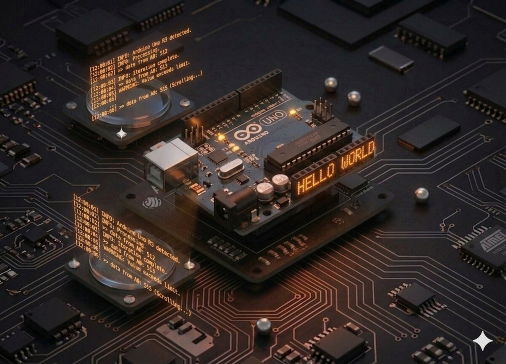

# Monitorul Serial

Serial Monitor nu este doar pentru a citi mesaje de la Arduino — poți și **trimite comenzi** de la tastatură. În acest proiect extinzi montajul din **Proiect 16** ca să controlezi fiecare LED individual.



## Componente necesare

Același montaj ca la **Proiect 16** (opt LED-uri cu 74HC595). Niciun component nou necesar.

| Componentă | Cantitate |
|------------|-----------|
| Arduino Uno R3 + montaj din Proiect 16 | 1 |

## Cum funcționează

### Protocol

Vei trimite prin Serial Monitor:
- Un **număr între 0 și 7** → aprinde LED-ul cu acel index.
- Litera **`x`** → stinge toate LED-urile.

### Citirea caracterelor

Serial Monitor trimite la Arduino exact ce ai tastat, **caracter cu caracter**. Fiecare caracter este stocat într-un **buffer** până îl citim.

Funcții cheie:
- `Serial.available()` — returnează numărul de caractere în buffer.
- `Serial.read()` — returnează primul caracter și îl scoate din buffer.
- `Serial.print()` — trimite text înapoi spre PC.
- `Serial.println()` — trimite text + linie nouă.

### Trucul aritmetic

Ca să transformi caracterul `'3'` în numărul 3, folosești:
```cpp
int led = ch - '0';  // '3' - '0' = 3 (ASCII)
```
Caracterele sunt de fapt numere în spatele scenelor (codul ASCII al `'0'` = 48, al `'1'` = 49, etc.).

## Conectare

Identic cu **Proiect 16** — aceleași conexiuni la 74HC595 și LED-uri.

## Cod

```cpp
/*
 * Proiect 17 — Monitor Serial: comenzi pentru 8 LED-uri
 */

int latchPin = 11;
int clockPin = 9;
int dataPin = 12;
byte leds = 0;

void updateShiftRegister() {
  digitalWrite(latchPin, LOW);
  shiftOut(dataPin, clockPin, LSBFIRST, leds);
  digitalWrite(latchPin, HIGH);
}

void setup() {
  pinMode(latchPin, OUTPUT);
  pinMode(dataPin, OUTPUT);
  pinMode(clockPin, OUTPUT);
  updateShiftRegister();
  Serial.begin(9600);
  Serial.println("Introdu un numar 0-7 sau 'x' pentru a sterge:");
}

void loop() {
  if (Serial.available()) {
    char ch = Serial.read();

    if (ch >= '0' && ch <= '7') {
      int led = ch - '0';
      bitSet(leds, led);
      updateShiftRegister();
      Serial.print("Aprind LED ");
      Serial.println(led);
    }
    if (ch == 'x') {
      leds = 0;
      updateShiftRegister();
      Serial.println("Toate LED-urile stinse");
    }
  }
}
```

## Ce să încerci

- Adaugă comanda `'t'` pentru a **toggle** (comuta) un LED.
- Trimite o **secvență**: `1357` aprinde simultan LED-urile 1, 3, 5, 7.
- Folosește `Serial.readStringUntil('\n')` ca să citești linii întregi.
- Adaugă un **meniu** afișat când trimiți `?`.

## Note

- La **baud rate**: 9600 în cod = 9600 în Serial Monitor (jos-dreapta).
- Unele caractere ciudate apar dacă baud rate-urile nu se potrivesc.
- Fără `if (Serial.available())`, `Serial.read()` returnează `-1` când bufferul este gol.
- **ASCII**: `'0'` = 48, `'A'` = 65, `'a'` = 97. Scăderea `ch - '0'` funcționează pentru cifre.

---

**Vezi și:** [Toate proiectele kit-ului](kits.md)
