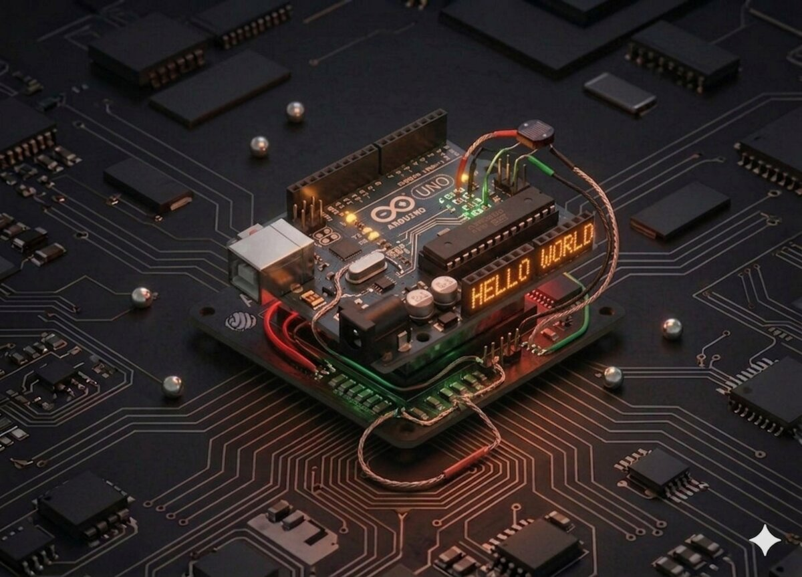

# Fotocelulă (senzor de lumină)

Un **fotorezistor** (LDR) îți permite să "simți" cantitatea de lumină din mediu. Îl combinăm cu șirul de 8 LED-uri ca să avem un **indicator vizual** de luminozitate.



## Componente necesare

| Componentă | Cantitate |
|------------|-----------|
| Arduino Uno R3 | 1 |
| Breadboard 830 puncte | 1 |
| LED | 8 |
| Rezistență 220 Ω | 8 |
| Rezistență 1 kΩ | 1 |
| 74HC595 IC | 1 |
| Fotorezistor (fotocelulă / LDR) | 1 |
| Fire jumper M-M | 16 |

## Cum funcționează

### LDR (Light Dependent Resistor)

Un LDR este o rezistență a cărei valoare depinde de lumină:
- **Întuneric complet** → ~ 50 kΩ
- **Lumină puternică** → ~ 500 Ω

Ca să transformăm variația de rezistență într-o tensiune citibilă de Arduino, construim un **divizor de tensiune** cu o rezistență fixă de 1 kΩ:

```
    5V ──[LDR]──┬──[1 kΩ]── GND
                │
                └── A0
```

Când este **lumină multă** → LDR are rezistență mică → tensiune mare pe A0 → `analogRead()` aproape de 1023.
Când este **întuneric** → LDR are rezistență mare → tensiune mică pe A0 → `analogRead()` aproape de 0.

### Bara de LED-uri

Folosim același cod ca la Proiect 16 (cu 74HC595), dar acum numărul de LED-uri aprinse depinde de lumina detectată.

## Conectare

Același cablaj ca la Proiectul 16 pentru cele 8 LED-uri și 74HC595. În plus:

| Componentă | Arduino |
|-----------|---------|
| LDR (picior 1) | 5V |
| LDR (picior 2) + 1 kΩ la GND | A0 |

## Cod

```cpp
/*
 * Proiect 18 — Fotocelulă
 * Numărul de LED-uri aprinse = cât de multă lumină este.
 */

int latchPin = 11;
int clockPin = 9;
int dataPin = 12;
int lightPin = A0;
byte leds = 0;

void updateShiftRegister() {
  digitalWrite(latchPin, LOW);
  shiftOut(dataPin, clockPin, LSBFIRST, leds);
  digitalWrite(latchPin, HIGH);
}

void setup() {
  pinMode(latchPin, OUTPUT);
  pinMode(dataPin, OUTPUT);
  pinMode(clockPin, OUTPUT);
  Serial.begin(9600);
}

void loop() {
  int reading = analogRead(lightPin);
  int numLEDSLit = reading / 57; // împarte 0-1023 în 9 intervale

  if (numLEDSLit > 8) numLEDSLit = 8;

  leds = 0;
  for (int i = 0; i < numLEDSLit; i++) {
    bitSet(leds, i);
  }
  updateShiftRegister();

  Serial.print("Lumina: ");
  Serial.print(reading);
  Serial.print("  LED-uri: ");
  Serial.println(numLEDSLit);

  delay(100);
}
```

## Ce să încerci

- Inversează logica: cu cât este mai **întuneric**, cu atât mai multe LED-uri.
- Aprinde un **LED roșu** când este prea întuneric (pentru lampă automată).
- Combină cu un **releu** (Proiect 11) ca să aprinzi un bec real la apus.
- Afișează intensitatea pe un **LCD** (Proiect 14) cu o bară textuală.

## Note

- Acoperă LDR-ul cu degetul și valoarea va scădea.
- Constanța citirilor depinde de **iluminatul ambiant** — fluorescente dau mici oscilații.
- Pentru senzori mai precis, poți folosi un senzor digital precum **BH1750**.

---

**Vezi și:** [Toate proiectele kit-ului](kits.md)
