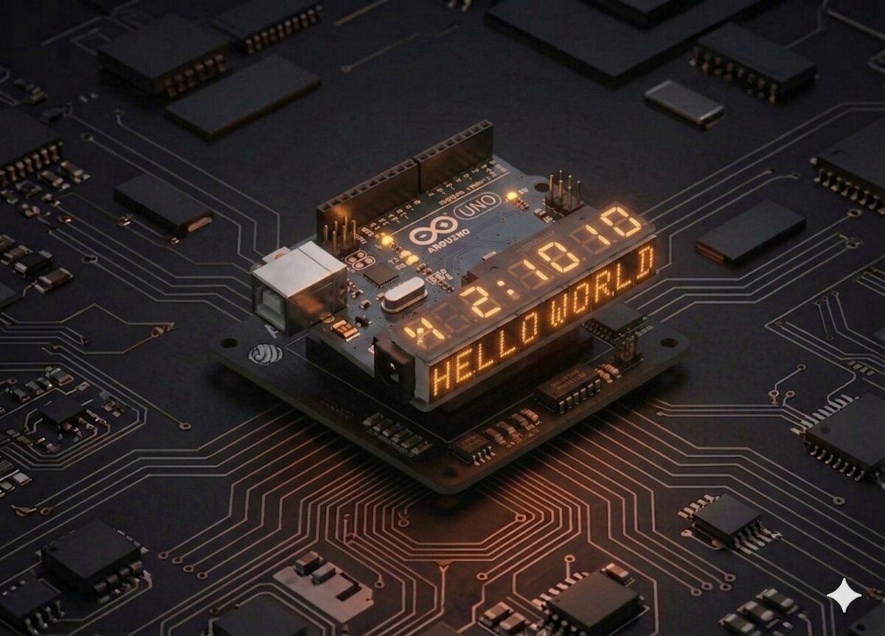

# Afișaj cu 7 segmente

Afișajele cu 7 segmente sunt omniprezente: ceasuri digitale, microunde, cuptoare, afișaje de prețuri. Înveți cum să afișezi cifre pe ele.



## Componente necesare

| Componentă | Cantitate |
|------------|-----------|
| Arduino Uno R3 | 1 |
| Breadboard 830 puncte | 1 |
| 74HC595 IC | 1 |
| Afișaj 7-segmente 1 cifră (catod comun) | 1 |
| Rezistență 220 Ω | 8 |
| Fire jumper M-M | 26 |

## Cum funcționează

Un afișaj cu 7 segmente are **7 LED-uri** dispuse în forma cifrei 8, plus un al 8-lea (`DP` — Decimal Point). Ca să formezi o cifră, aprinzi combinația corectă.

| Cifră | Segmente aprinse |
|-------|------------------|
| 0 | a, b, c, d, e, f |
| 1 | b, c |
| 2 | a, b, d, e, g |
| 3 | a, b, c, d, g |
| 4 | b, c, f, g |
| 5 | a, c, d, f, g |
| 6 | a, c, d, e, f, g |
| 7 | a, b, c |
| 8 | a, b, c, d, e, f, g |
| 9 | a, b, c, d, f, g |

### Catod comun vs anod comun

- **Catod comun**: toate catodurile sunt legate la GND. Segmentele se aprind când primesc `HIGH`.
- **Anod comun**: toate anozii sunt la +5V. Segmentele se aprind când primesc `LOW`.

În kit este **catod comun**, deci pinii `3` și `8` (pinii comuni) merg la GND.

### Maparea 74HC595 → segmente

| Q output | Segment afișaj |
|----------|----------------|
| Q0 | A |
| Q1 | B |
| Q2 | C |
| Q3 | D |
| Q4 | E |
| Q5 | F |
| Q6 | G |
| Q7 | DP |

Cu aceeași logică de `shiftOut()` ca la Proiect 16, trimitem un byte unde fiecare bit corespunde unui segment.

## Conectare

74HC595 conectat ca la Proiect 16, dar în loc de LED-uri ai afișajul:

| 74HC595 | Arduino/Altceva |
|---------|-----------------|
| DS (pin 14) | D2 |
| ST_CP (pin 12) | D3 |
| SH_CP (pin 11) | D4 |
| VCC, MR | 5V |
| GND, OE | GND |
| Q0–Q7 | prin 220 Ω la segmentele A–DP ale afișajului |
| Pin 3, 8 ai afișajului | GND (catod comun) |

## Cod

```cpp
/*
 * Proiect 19 — Afișaj 7-segmente cu 74HC595
 * Numără de la 9 la 0.
 */

int dataPin = 2;
int latchPin = 3;
int clockPin = 4;

// Tabelul cifrelor (catod comun): bit 7=DP, 6=G, 5=F, 4=E, 3=D, 2=C, 1=B, 0=A
byte digits[10] = {
  B00111111, // 0
  B00000110, // 1
  B01011011, // 2
  B01001111, // 3
  B01100110, // 4
  B01101101, // 5
  B01111101, // 6
  B00000111, // 7
  B01111111, // 8
  B01101111  // 9
};

void displayDigit(byte d) {
  digitalWrite(latchPin, LOW);
  shiftOut(dataPin, clockPin, LSBFIRST, digits[d]);
  digitalWrite(latchPin, HIGH);
}

void setup() {
  pinMode(dataPin, OUTPUT);
  pinMode(latchPin, OUTPUT);
  pinMode(clockPin, OUTPUT);
}

void loop() {
  for (int i = 9; i >= 0; i--) {
    displayDigit(i);
    delay(1000);
  }
}
```

## Ce să încerci

- Numără **în sus** (0 → 9) și încearcă să adaugi punctul zecimal.
- Afișează un **cronometru** care se activează la apăsarea unui buton.
- Arată câte obstacole detectează senzorul ultrasonic sub 50 cm.
- Fă un mic joc: tasta apăsată pe keypad (Proiect 13) apare pe afișaj.

## Note

- Dacă ai afișaj **anod comun**, inversează toți biții: `~digits[d]`.
- Segmentele vin în ordine diferită pe diverse afișaje. Citește datasheet-ul.
- Segmentele luminează prea tare? Crește rezistența la 330 Ω sau 470 Ω.

---

**Vezi și:** [Toate proiectele kit-ului](kits.md)
