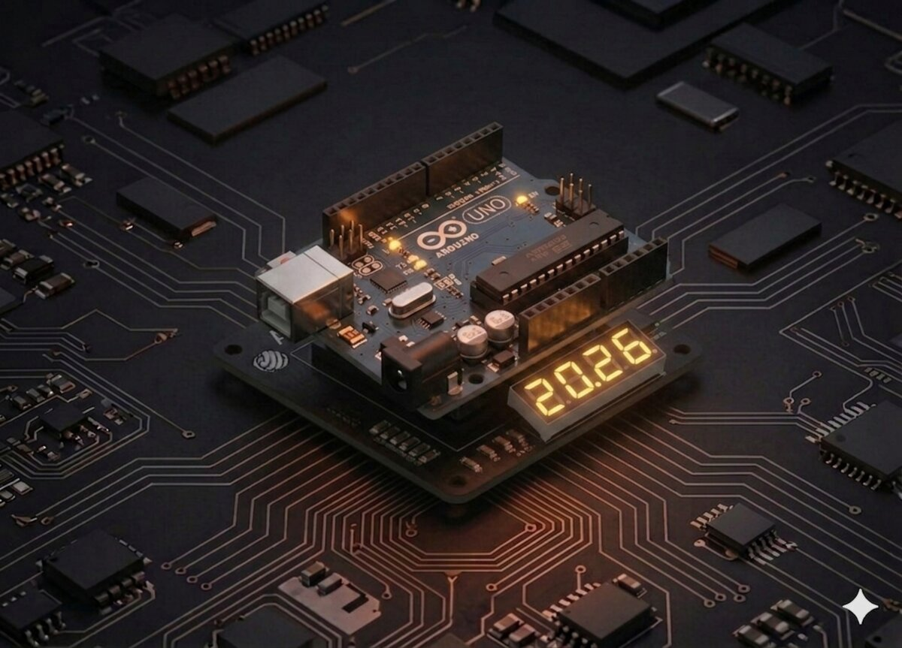

# Afișaj cu 4 cifre și 7 segmente

Cum afișezi un număr precum `1234` pe un singur modul cu 4 cifre, când fiecare cifră are 7 segmente? Răspunsul magic: **multiplexarea** și **POV** (Persistence of Vision).



## Componente necesare

| Componentă | Cantitate |
|------------|-----------|
| Arduino Uno R3 | 1 |
| Breadboard 830 puncte | 1 |
| 74HC595 IC | 1 |
| Afișaj 4 cifre 7-segmente | 1 |
| Rezistență 220 Ω | 4 |
| Fire jumper M-M | 23 |

## Cum funcționează

### Problema: prea multe LED-uri

4 cifre × 8 segmente = **32 LED-uri**. Nu le poți aprinde pe toate individual fără să rămâi fără pini.

### Soluția: multiplexare

Vizualizează afișajul:
- Toate cele 4 cifre **împart aceiași 8 pini pentru segmente**.
- Fiecare cifră are un pin propriu de "activare" (un **common cathode** per digit).

În loc să aprinzi toate cifrele simultan, tu:
1. Aprinzi doar **cifra 1** cu segmentele pentru `1`.
2. Stingi cifra 1, aprinzi **cifra 2** cu segmentele pentru `2`.
3. Continuă cu cifrele 3 și 4.
4. Repeți foarte rapid (> 50 Hz).

**Persistența vederii (POV)** face ca ochiul să perceapă toate cifrele aprinse simultan, deși fiecare este activă doar 1/4 din timp.

## Conectare

4 pini Arduino pentru alegerea cifrei active (catodul comun al fiecărei cifre) + 74HC595 pentru segmente.

| Componentă | Arduino |
|-----------|---------|
| Cifra 1 (common) | D10 |
| Cifra 2 (common) | D11 |
| Cifra 3 (common) | D12 |
| Cifra 4 (common) | D13 |
| 74HC595 DS | D2 |
| 74HC595 ST_CP | D3 |
| 74HC595 SH_CP | D4 |
| 74HC595 VCC, MR | 5V |
| 74HC595 GND, OE | GND |
| Q0..Q7 | prin 220 Ω la segmentele A–DP |

## Cod

```cpp
/*
 * Proiect 20 — Afișaj 4 cifre 7-segmente
 * Afișează un număr între 0 și 9999, incrementat la fiecare secundă.
 */

int dataPin  = 2;
int latchPin = 3;
int clockPin = 4;
int digitPins[4] = {10, 11, 12, 13}; // cifra 1..4

byte digits[10] = {
  B00111111, B00000110, B01011011, B01001111, B01100110,
  B01101101, B01111101, B00000111, B01111111, B01101111
};

int number = 0;
unsigned long lastIncrement = 0;

void showDigit(byte position, byte d) {
  for (int i = 0; i < 4; i++) digitalWrite(digitPins[i], HIGH);

  digitalWrite(latchPin, LOW);
  shiftOut(dataPin, clockPin, LSBFIRST, digits[d]);
  digitalWrite(latchPin, HIGH);

  // Aprinde doar cifra curentă (catod comun = LOW = activ)
  digitalWrite(digitPins[position], LOW);
  delay(2);
}

void displayNumber(int num) {
  for (int pos = 0; pos < 4; pos++) {
    int d = (num / (int)pow(10, 3 - pos)) % 10;
    showDigit(pos, d);
  }
}

void setup() {
  pinMode(dataPin, OUTPUT);
  pinMode(latchPin, OUTPUT);
  pinMode(clockPin, OUTPUT);
  for (int i = 0; i < 4; i++) {
    pinMode(digitPins[i], OUTPUT);
    digitalWrite(digitPins[i], HIGH);
  }
}

void loop() {
  displayNumber(number);

  if (millis() - lastIncrement > 1000) {
    number++;
    if (number > 9999) number = 0;
    lastIncrement = millis();
  }
}
```

## Ce să încerci

- Contor care **numără secundele** din momentul pornirii.
- Cronometru start/stop cu un buton (Proiect 4).
- Afișează **temperatura** (Proiect 15) sau **distanța** (Proiect 10).
- Joc de "ghicit numărul" cu tastatură (Proiect 13).

## Note

- Dacă cifrele **clipesc vizibil**, reduce `delay(2)` la 1 ms.
- Diferite afișaje au **mapări diferite** de pini — consultă datasheet-ul.
- Poți folosi o bibliotecă precum **`SevSeg`** pentru a simplifica codul.

---

**Vezi și:** [Toate proiectele kit-ului](kits.md)
