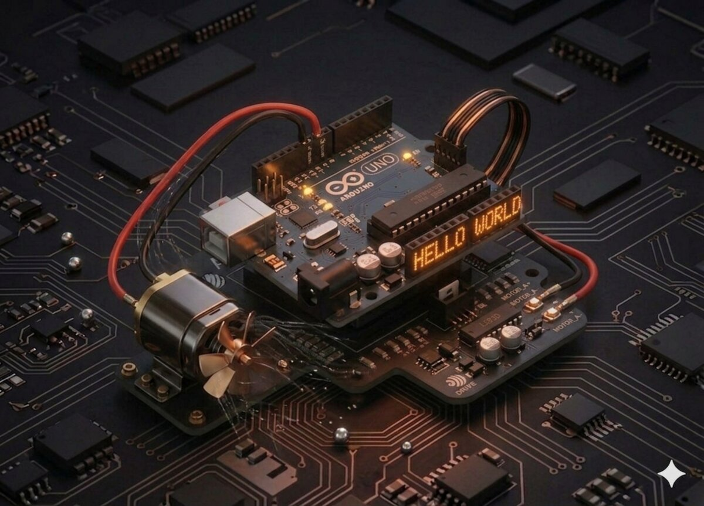

# Proiect 21 — Motor DC

Motoarele DC sunt peste tot: jucării, ventilatoare, mașinuțe, roboți. Ca să le poți controla **direcția și viteza** din Arduino, ai nevoie de un driver — **L293D**.



## Componente necesare

| Componentă | Cantitate |
|------------|-----------|
| Arduino Uno R3 | 1 |
| Breadboard 830 puncte | 1 |
| L293D IC | 1 |
| Motor DC 3–6 V + paletă ventilator | 1 |
| Modul sursă de alimentare | 1 |
| Adaptor 9V / 1A | 1 |
| Fire jumper M-M | 5 |

## Cum funcționează

### De ce nu conectăm motorul direct la Arduino?

Un pin Arduino poate livra maxim ~20 mA, iar un motor DC poate consuma 200-500 mA. În plus, când motorul este oprit, generează un **vârf de tensiune inductivă** care poate distruge Arduino. **Niciodată** nu conecta un motor direct la placă!

### L293D — H-Bridge

L293D este un cip cu 16 pini care conține **două H-punți**. O H-punte permite ca motorul să primească curent în orice direcție, deci poți controla:
- **Direcția** de rotație (prin 2 pini IN1/IN2).
- **Viteza** (prin PWM pe pinul Enable — EN1).
- **Oprirea** (ambii IN la LOW).

### Logica direcțiilor

| IN1 | IN2 | Efect |
|-----|-----|-------|
| LOW | LOW | Stop (free-wheel) |
| HIGH | LOW | Rotire sens 1 |
| LOW | HIGH | Rotire sens 2 |
| HIGH | HIGH | Frânare (scurtcircuit) |

**Important**: L293D are nevoie de **două alimentări**:
- `VSS` (pin 16): 5 V pentru logica internă (de la Arduino).
- `VS` (pin 8): tensiunea motorului (4.5 – 36 V) — ideal de la o sursă externă.

## Conectare

| L293D pin | Conexiune |
|-----------|-----------|
| 1 (EN1)   | D5 (PWM, viteză) |
| 2 (IN1)   | D4 |
| 3 (OUT1)  | motor + |
| 4, 5, 12, 13 (GND) | GND |
| 6 (OUT2)  | motor − |
| 7 (IN2)   | D3 |
| 8 (VS)    | + sursă externă (6–9 V) |
| 16 (VSS)  | 5V Arduino |
| GND sursă externă | GND Arduino (masa comună!) |

## Cod

```cpp
/*
 * Proiect 21 — Motor DC cu L293D
 * Rotește în ambele sensuri, cu pauză între mișcări.
 */

int enablePin = 5;
int in1Pin = 4;
int in2Pin = 3;

void setup() {
  pinMode(enablePin, OUTPUT);
  pinMode(in1Pin, OUTPUT);
  pinMode(in2Pin, OUTPUT);
}

void loop() {
  // Rotire sens 1 (în sensul acelor de ceasornic)
  analogWrite(enablePin, 150);  // viteză (0-255)
  digitalWrite(in1Pin, HIGH);
  digitalWrite(in2Pin, LOW);
  delay(2000);

  // Oprire
  analogWrite(enablePin, 0);
  delay(2000);

  // Rotire sens 2 (invers)
  analogWrite(enablePin, 150);
  digitalWrite(in1Pin, LOW);
  digitalWrite(in2Pin, HIGH);
  delay(2000);

  // Oprire
  analogWrite(enablePin, 0);
  delay(2000);
}
```

## Ce să încerci

- Controlează viteza cu un **potențiometru** (sau joystick — Proiect 9).
- Pornește/oprește motorul cu un **buton** (Proiect 4).
- Combină cu senzorul ultrasonic: motorul se oprește când detectează un obstacol.
- Realizează o mini-mașină cu două motoare (ai nevoie de un al doilea L293D sau un shield driver).

## Note

- **Masa (GND) trebuie să fie comună** între sursa motorului și Arduino!
- Acest cod **nu folosește sursă externă** pentru exemplificare rapidă, dar rotația continuă stabilă necesită alimentare separată.
- Valoarea PWM sub ~80 poate fi insuficientă pentru a porni motorul (torsiune de pornire).
- L293D se încălzește — este normal la curenți mari.

---

**Vezi și:** [Toate proiectele kit-ului](kits.md)
