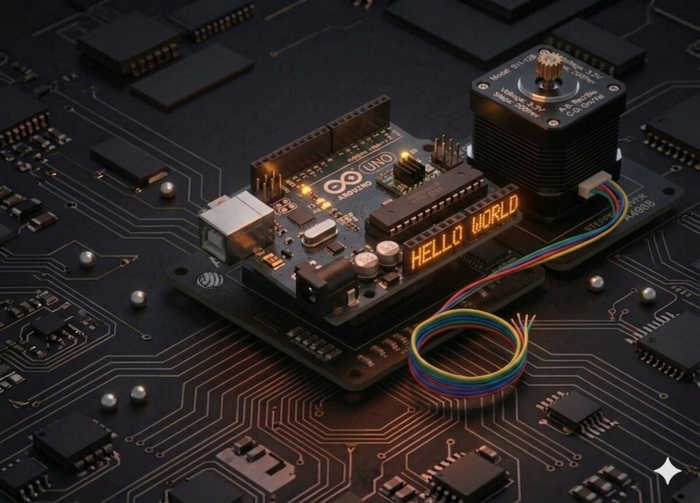

# Proiect 22 — Motor pas cu pas

Un **motor pas cu pas** (stepper) se rotește cu pași discreți — exact atâtea grade câte îi comanzi, fără nevoia unui senzor de poziție. Este folosit în imprimante 3D, scannere, roboți și mai ales acolo unde ai nevoie de **poziționare precisă**.



## Componente necesare

| Componentă | Cantitate |
|------------|-----------|
| Arduino Uno R3 | 1 |
| Breadboard 830 puncte | 1 |
| Motor stepper 28BYJ-48 | 1 |
| Modul driver ULN2003 | 1 |
| Fire jumper F-M | 6 |
| Fir jumper M-M | 1 |

## Cum funcționează

### Stepper 28BYJ-48

Este un motor **unipolar** cu 4 faze. În interiorul lui există 4 bobine; aprinzând bobinele într-o **secvență specifică**, axul se rotește cu un pas foarte mic (5.625° / 64 din cauza reductorului intern).

**Parametri 28BYJ-48:**
- Tensiune: **5 V**
- Fază: 4
- Pași per rotație: **2048** (mod full-step cu reductor)
- Unghi per pas: **0.176°**

### Driver ULN2003

Motorul consumă ~240 mA per bobină — prea mult pentru Arduino. Cipul **ULN2003** este un array de 7 tranzistoare Darlington care amplifică semnalele de la Arduino pentru a alimenta bobinele. Modulul din kit are deja ULN2003 + conector + 4 LED-uri indicatoare pentru faze.

Arduino trimite semnale către pinii **IN1–IN4**, iar driver-ul comandă bobinele.

## Conectare

| Modul ULN2003 | Arduino |
|---------------|---------|
| IN1 | D8 |
| IN2 | D9 |
| IN3 | D10 |
| IN4 | D11 |
| `+` (alimentare motor) | 5V |
| `−` (GND) | GND |

Motorul se conectează în **jack-ul alb** de pe modul (nu-l poți greși — se potrivește doar într-o poziție).

## Cod

```cpp
/*
 * Proiect 22 — Motor stepper 28BYJ-48 cu ULN2003
 * Rotește o tură completă într-un sens, apoi invers.
 * Bibliotecă: Stepper (inclusă în Arduino IDE)
 */

#include <Stepper.h>

// Numărul de pași pentru o rotație completă
const int stepsPerRevolution = 2048;

// Notă: ordinea pinilor este (8, 10, 9, 11) pentru secvența corectă pe 28BYJ-48
Stepper myStepper(stepsPerRevolution, 8, 10, 9, 11);

void setup() {
  myStepper.setSpeed(10); // rotații/minut
  Serial.begin(9600);
}

void loop() {
  Serial.println("Rotire inainte");
  myStepper.step(stepsPerRevolution);
  delay(1000);

  Serial.println("Rotire inapoi");
  myStepper.step(-stepsPerRevolution);
  delay(1000);
}
```

## Ce să încerci

- Rotește motorul la **unghi specific** (ex: 90° = `stepsPerRevolution / 4`).
- Controlează-l cu un **joystick** (Proiect 9): stânga = CCW, dreapta = CW.
- Atașează o săgeată pe ax și construiește un **indicator mecanic** (busolă, barometru).
- Combină cu un senzor ultrasonic (Proiect 10) pentru un radar rotativ.

## Note

- Biblioteca **`Stepper`** este preinstalată în Arduino IDE.
- Ordinea pinilor `(8, 10, 9, 11)` este importantă — dacă rotirea este neregulată, încearcă `(8, 9, 10, 11)`.
- Stepper-ul are multe pași și o viteză limitată. Pentru mișcări rapide (>17 rpm) folosește biblioteca **`AccelStepper`**.
- LED-urile de pe driver trebuie să clipească secvențial când motorul se rotește.

---

**Vezi și:** [Toate proiectele kit-ului](kits.md)
