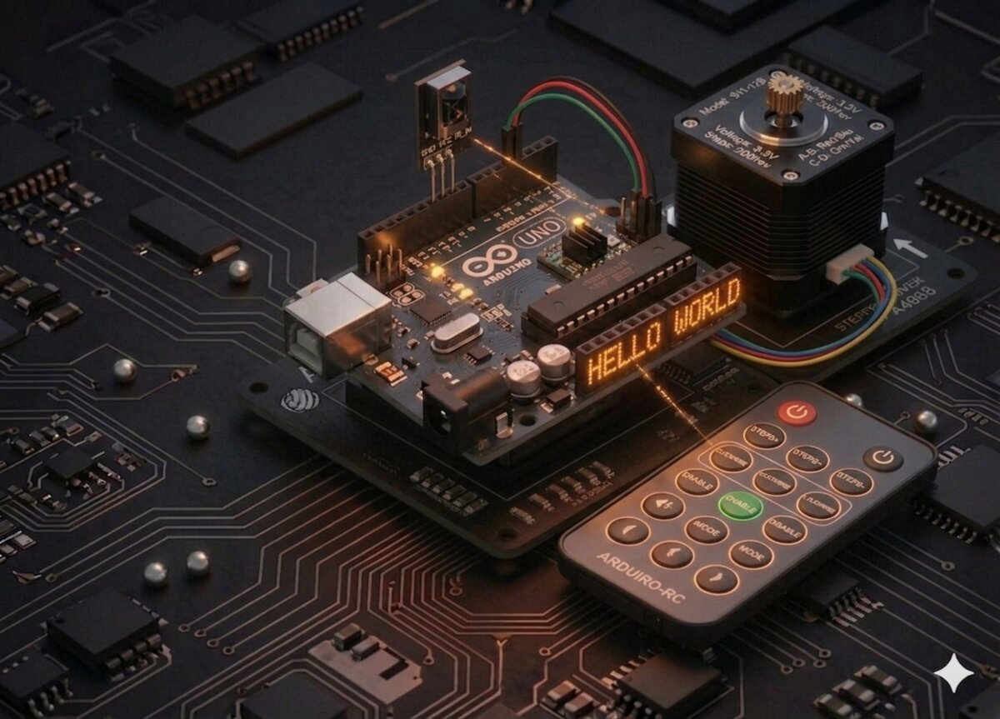

# Proiect 23 — Motor pas cu pas cu telecomandă

Acest proiect combină două concepte pe care le-ai învățat: **receptorul IR** (Proiect 12) și **motorul pas cu pas** (Proiect 22). Rezultatul: un mini-sistem care se rotește la comandă de pe telecomandă.



## Componente necesare

| Componentă | Cantitate |
|------------|-----------|
| Arduino Uno R3 | 1 |
| Breadboard 830 puncte | 1 |
| Receptor IR | 1 |
| Telecomandă IR | 1 |
| Modul driver ULN2003 | 1 |
| Motor stepper 28BYJ-48 | 1 |
| Fire jumper F-M | 9 |
| Fir jumper M-M | 1 |

## Cum funcționează

### Logica aplicației

- Apeși **butonul SUS** (↑) pe telecomandă → motorul face o rotație completă în sensul acelor de ceasornic.
- Apeși **butonul JOS** (↓) → o rotație completă în sens invers.
- Pentru alte butoane, motorul stă pe loc.

### Decodarea IR

Fiecare buton al telecomenzii trimite un cod unic (hexazecimal). Trebuie să afli codurile **butoanelor sus/jos** pentru telecomanda ta:
1. Încarcă mai întâi codul din Proiect 12.
2. Apasă butoanele și notează-ți codurile afișate pe Serial Monitor.
3. Înlocuiește valorile în codul de jos.

### De ce sursă externă?

Motorul consumă destul de mult curent. În timp ce Arduino îl poate alimenta pentru mișcări scurte, la utilizare intensă este mai bine să folosești o **sursă separată** (modulul de alimentare + adaptorul 9 V din kit).

## Conectare

| Componentă | Arduino |
|-----------|---------|
| Receptor IR S | D12 |
| Receptor IR VCC | 5V |
| Receptor IR GND | GND |
| ULN2003 IN1 | D8 |
| ULN2003 IN2 | D9 |
| ULN2003 IN3 | D10 |
| ULN2003 IN4 | D11 |
| ULN2003 `+` | 5V (sau sursă externă) |
| ULN2003 `−` | GND (comun cu Arduino) |

## Cod

```cpp
/*
 * Proiect 23 — Stepper controlat prin IR
 * Sus = rotație CW, Jos = rotație CCW.
 * Biblioteci: IRremote, Stepper
 */

#include <IRremote.h>
#include <Stepper.h>

const int stepsPerRevolution = 2048;
const int IR_PIN = 12;

// Înlocuiește aceste coduri cu cele ale telecomenzii tale!
#define BUTTON_UP   0x46
#define BUTTON_DOWN 0x15

Stepper myStepper(stepsPerRevolution, 8, 10, 9, 11);

void setup() {
  Serial.begin(9600);
  IrReceiver.begin(IR_PIN, ENABLE_LED_FEEDBACK);
  myStepper.setSpeed(10);
}

void loop() {
  if (IrReceiver.decode()) {
    uint32_t code = IrReceiver.decodedIRData.command;
    Serial.print("Primit: 0x"); Serial.println(code, HEX);

    if (code == BUTTON_UP) {
      Serial.println("SUS -> rotire CW");
      myStepper.step(stepsPerRevolution);
    } else if (code == BUTTON_DOWN) {
      Serial.println("JOS -> rotire CCW");
      myStepper.step(-stepsPerRevolution);
    }
    IrReceiver.resume();
  }
}
```

## Ce să încerci

- Adaugă butoane pentru **jumătate de rotație** sau **90°**.
- Folosește tastatura cu membrană (Proiect 13) pentru control pe fir.
- Poziționează o săgeată la ora curentă — creează un ceas analogic mecanic.
- Controlează direcția unei mini-antene sau a unui capac.

## Note

- Citirea IR durează câteva zeci de ms. În timp ce motorul se mișcă (`step()` blochează), **nu poți primi comenzi**.
- Codurile de buton depind de telecomanda ta — nu le copia orbește!
- Dacă motorul se mișcă greu, asigură-te că sursa de alimentare dă suficient curent.

---

**Vezi și:** [Toate proiectele kit-ului](kits.md)
