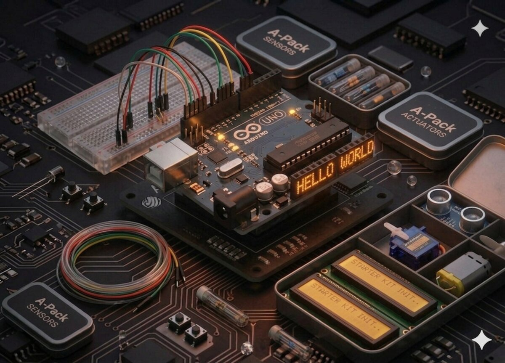

# Super Starter Kit Arduino UNO (CH340)

Acest kit include un **Arduino Uno (CH340)** și toate componentele necesare pentru 25 de proiecte — de la primul "Hello World" până la motoare pas cu pas controlate prin telecomandă IR.

Fiecare proiect este construit peste cunoștințele celui anterior. Îți recomandăm să le parcurgi în ordine, dar poți sări peste cele care nu te interesează.

## Cum să începi

1. **Instalează Arduino IDE** de pe [arduino.cc](https://www.arduino.cc/en/software).
2. **Conectează placa** prin USB. Pentru CH340, poate fi nevoie să instalezi [driverul CH340](https://sparks.gogo.co.nz/ch340.html).
3. În Arduino IDE, selectează `Tools → Board → Arduino Uno` și portul COM corect.
4. Începe cu **Proiectul 01 — Hello World**.

## Proiecte

### Bazele (01–05)

| # | Proiect | Descriere |
|---|---------|-----------|
| 01 | [Hello World](01-hello-world.md) | Primul contact cu Serial Monitor și LED-ul integrat. |
| 02 | [LED intermitent](02-led-blinking.md) | Primul circuit pe breadboard — LED pe pin extern. |
| 03 | [LED RGB](03-rgb-led.md) | PWM și amestecul culorilor cu un LED tricolor. |
| 04 | [Intrări digitale (butoane)](04-digital-inputs.md) | Citire butoane cu rezistență pull-up internă. |
| 05 | [Senzor cu bilă (înclinare)](05-tilt-ball-switch.md) | Detectează orientarea cu un switch mecanic. |

### Sunet și mișcare (06–10)

| # | Proiect | Descriere |
|---|---------|-----------|
| 06 | [Buzzer activ](06-active-buzzer.md) | Primul sunet — bip intermitent simplu. |
| 07 | [Buzzer pasiv (melodii)](07-passive-buzzer.md) | Note muzicale prin `tone()` și frecvență. |
| 08 | [Servomotor](08-servo.md) | Rotire precisă 0-180° cu biblioteca `Servo`. |
| 09 | [Joystick analogic](09-joystick.md) | Control pe 2 axe + buton. |
| 10 | [Senzor ultrasonic (distanță)](10-ultrasonic-sensor.md) | Măsurare distanță cu HC-SR04. |

### Comunicare și control (11–15)

| # | Proiect | Descriere |
|---|---------|-----------|
| 11 | [Modul releu](11-relay.md) | Comandă aparate de putere mare cu un releu 5V. |
| 12 | [Receptor IR (telecomandă)](12-ir-receiver.md) | Decodarea apăsărilor de telecomandă. |
| 13 | [Tastatură cu membrană](13-membrane-switch.md) | Keypad matricial 4×4 cu `Keypad` library. |
| 14 | [Afișaj LCD1602 cu I2C](14-lcd1602-i2c.md) | Text pe ecran cu doar 4 fire (I2C). |
| 15 | [Termometru cu termistor](15-thermometer.md) | Afișează temperatura ambientală pe LCD. |

### Tehnici avansate (16–20)

| # | Proiect | Descriere |
|---|---------|-----------|
| 16 | [Opt LED-uri cu 74HC595](16-shift-register-leds.md) | Registrul de deplasare — 8 ieșiri, 3 pini. |
| 17 | [Monitorul Serial (comenzi)](17-serial-monitor.md) | Controlează LED-urile prin comenzi text. |
| 18 | [Fotocelulă (senzor de lumină)](18-photocell.md) | Bară-meter luminoasă bazată pe LDR. |
| 19 | [Afișaj cu 7 segmente](19-seven-segment-display.md) | Numere 0-9 pe o singură cifră. |
| 20 | [Afișaj cu 4 cifre](20-four-digit-display.md) | Multiplexare și POV pentru 4 cifre. |

### Motoare și senzori de mediu (21–25)

| # | Proiect | Descriere |
|---|---------|-----------|
| 21 | [Motor DC](21-dc-motor.md) | Control viteză și direcție cu L293D. |
| 22 | [Motor pas cu pas](22-stepper-motor.md) | Rotație precisă cu 28BYJ-48 + ULN2003. |
| 23 | [Motor pas cu pas cu telecomandă](23-stepper-with-remote.md) | Combină IR-ul cu stepperul. |
| 24 | [Senzor nivel apă](24-water-level-sensor.md) | Detecție lichid — alarmă de inundație. |
| 25 | [Senzor de sunet](25-sound-sensor.md) | Microfon electret pentru detecție audio. |

## Biblioteci necesare

Unele proiecte au nevoie de biblioteci suplimentare (instalabile din `Tools → Manage Libraries` în Arduino IDE):

| Proiect | Bibliotecă |
|---------|-----------|
| 07 Buzzer pasiv | `pitches.h` (opțional) |
| 12, 23 IR | `IRremote` |
| 13 Keypad | `Keypad` |
| 14, 15 LCD | `LiquidCrystal_I2C` |
| 22, 23 Stepper | `Stepper` (preinstalată) |

## Resurse suplimentare

- [Ghidul PDF oficial al kitului](https://github.com/ursoaia-edu/cerc_de_informatica_2025/blob/main/arduino/LA036%20Super%20Starter%20Kit%20for%20Arduino%20UNO(CH340)/Super%20Starter%20Kit%20for%20Arduino%20Uno%20(CH340).pdf)
- [Colecția de biblioteci pentru kit](https://github.com/ursoaia-edu/cerc_de_informatica_2025/tree/main/arduino/LA036%20Super%20Starter%20Kit%20for%20Arduino%20UNO(CH340)/Libraries)
- [Documentația oficială Arduino](https://docs.arduino.cc/)

## După kit

Când termini toate cele 25 de proiecte, încearcă [Cubul de LED-uri 3x3x3](../led_cube.md) — un proiect care combină multiplexarea, POV și animații.
