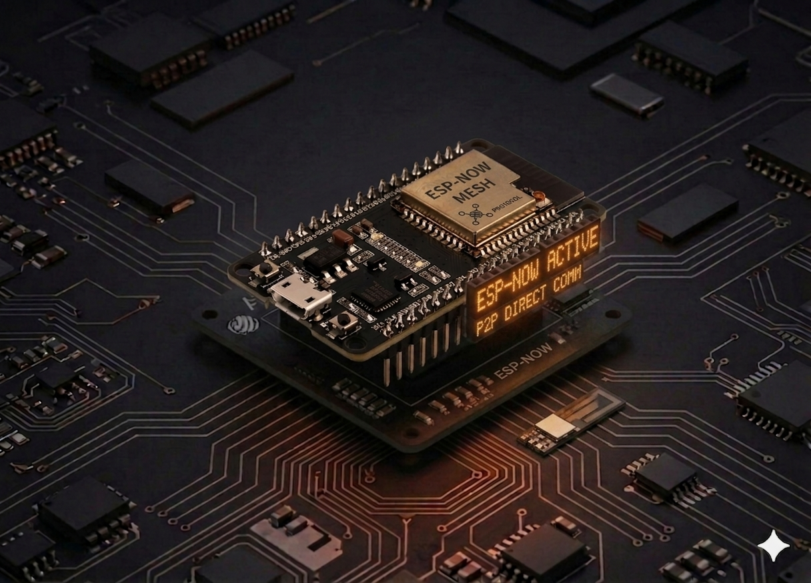

# Comunicare ESP-NOW între două plăci ESP32

Construiește un mic protocol punct-la-punct între două plăci ESP32: una trimite mesaje („sender"), cealaltă le primește („receiver"). Totul se petrece **fără router Wi-Fi** și **fără conexiune la internet** — plăcile vorbesc direct, folosind ESP-NOW, un protocol propriu Espressif construit peste radio Wi-Fi.



## Descriere

**ESP-NOW** este un protocol low-power dezvoltat de Espressif care permite plăcilor ESP32/ESP8266 să schimbe pachete scurte (până la 250 de octeți) direct, fără asociere cu un AP. Avantajele față de un setup HTTP/Wi-Fi clasic:

- **Latență mică** — sub 10 ms între trimitere și recepție.
- **Fără infrastructură** — nu ai nevoie de router, parolă, DHCP, IP-uri.
- **Consum redus** — plăcile pot dormi între pachete.
- **Până la 20 de peer-uri** unicast simultan.

Setup-ul tipic: identifici adresa MAC a fiecărei plăci, o adaugi ca *peer* pe partea cealaltă, apoi `send()` / `recv()` mută octeți de la una la alta.

## Componente

| Component | Cantitate |
|-----------|-----------|
| Placă ESP32 (DevKit V1 sau similar) | 2 |
| Cablu USB pentru fiecare placă | 2 |
| Firmware MicroPython instalat pe ambele plăci | — |

Nu sunt necesare componente externe — întreaga comunicare se face prin radio-ul intern al ESP32.

## Pasul 1: Citește adresa MAC a fiecărei plăci

Înainte să poți trimite ceva, ambele plăci trebuie să-și știe una alteia **adresa MAC** (6 octeți care identifică unic radio-ul). Încarcă scriptul de mai jos pe **fiecare** placă pe rând, rulează-l și notează adresa afișată.

```python
import network

wlan = network.WLAN(network.STA_IF)
wlan.active(True)

# Citește MAC-ul ca bytes
mac = wlan.config('mac')

# Format human-readable: aa:bb:cc:dd:ee:ff
mac_address = ':'.join('%02x' % b for b in mac)

print("MAC Address:", mac_address)
```

Output tipic:

```
MAC Address: 30:ae:a4:07:0d:64
```

Notează ambele adrese — în pașii următori le folosim ca `bytes literal` (ex. `b'\x30\xae\xa4\x07\x0d\x64'`).

!!! tip "Conversie rapidă"
    `30:ae:a4:07:0d:64` → `b'\x30\xae\xa4\x07\x0d\x64'`. Înlocuiește `:` cu `\x` și pune `b'…'` în jur.

## Pasul 2: Codul pentru sender

Sender-ul trimite la fiecare secundă un mesaj numerotat către MAC-ul receiver-ului. Înlocuiește `receiver_mac` cu adresa pe care ai citit-o de pe placa receptor.

```python
import network
import espnow
import time

# Statistici la fiecare 10 secunde
last_stats_time = time.time()
stats_interval = 10

# Wi-Fi în mod station — ESP-NOW are nevoie de radio activ, dar nu de o conexiune
sta = network.WLAN(network.STA_IF)
sta.active(True)
# sta.config(channel=1)  # Setează canalul explicit dacă pachetele nu ajung
sta.disconnect()

# Activează ESP-NOW
e = espnow.ESPNow()
try:
    e.active(True)
except OSError as err:
    print("Failed to initialize ESP-NOW:", err)
    raise

# MAC-ul receiver-ului (înlocuiește cu cel al tău)
receiver_mac = b'\x30\xae\xa4\xf6\x7d\x4c'
# receiver_mac = b'\xff\xff\xff\xff\xff\xff'  # broadcast către toți

# Înregistrează peer-ul
try:
    e.add_peer(receiver_mac)
except OSError as err:
    print("Failed to add peer:", err)
    raise


def print_stats():
    stats = e.stats()
    print("\nESP-NOW Statistics:")
    print(f"  Packets Sent: {stats[0]}")
    print(f"  Packets Delivered: {stats[1]}")
    print(f"  Packets Dropped (TX): {stats[2]}")
    print(f"  Packets Received: {stats[3]}")
    print(f"  Packets Dropped (RX): {stats[4]}")


message_count = 0
while True:
    try:
        message = f"Hello! ESP-NOW message #{message_count}"
        try:
            # Al treilea argument True = așteaptă confirmare (ACK)
            if e.send(receiver_mac, message, True):
                print(f"Sent message: {message}")
            else:
                print("Failed to send message (send returned False)")
        except OSError as err:
            print(f"Failed to send message (OSError: {err})")

        message_count += 1

        if time.time() - last_stats_time >= stats_interval:
            print_stats()
            last_stats_time = time.time()

        time.sleep(1)

    except OSError as err:
        print("Error:", err)
        time.sleep(5)

    except KeyboardInterrupt:
        print("Stopping sender...")
        e.active(False)
        sta.active(False)
        break
```

## Pasul 3: Codul pentru receiver

Receiver-ul ascultă pachete și le afișează pe consolă. Înlocuiește `sender_mac` cu adresa plăcii care trimite (necesar doar dacă vrei să restrângi pachetele acceptate; pentru broadcast nu trebuie).

```python
import network
import espnow
import time

last_stats_time = time.time()
stats_interval = 10

sta = network.WLAN(network.STA_IF)
sta.active(True)
sta.config(channel=1)  # Același canal ca sender-ul
sta.disconnect()

e = espnow.ESPNow()
try:
    e.active(True)
except OSError as err:
    print("Failed to initialize ESP-NOW:", err)
    raise

# MAC-ul sender-ului (opțional — necesar doar pentru unicast cu add_peer)
sender_mac = b'\x30\xae\xa4\x07\x0d\x64'

# Pentru broadcast (b'\xff' * 6) NU adăuga peer
# try:
#     e.add_peer(sender_mac)
# except OSError as err:
#     print("Failed to add peer:", err)
#     raise


def print_stats():
    stats = e.stats()
    print("\nESP-NOW Statistics:")
    print(f"  Packets Sent: {stats[0]}")
    print(f"  Packets Delivered: {stats[1]}")
    print(f"  Packets Dropped (TX): {stats[2]}")
    print(f"  Packets Received: {stats[3]}")
    print(f"  Packets Dropped (RX): {stats[4]}")


print("Listening for ESP-NOW messages...")
while True:
    try:
        # recv(timeout_ms) — întoarce (mac_expeditor, mesaj) sau (None, None) la timeout
        host, msg = e.recv(10000)
        if msg:
            print(f"Received from {host.hex()}: {msg.decode()}")

        if time.time() - last_stats_time >= stats_interval:
            print_stats()
            last_stats_time = time.time()

    except OSError as err:
        print("Error:", err)
        time.sleep(5)

    except KeyboardInterrupt:
        print("Stopping receiver...")
        e.active(False)
        sta.active(False)
        break
```

## Cum rulezi

1. Pe **placa A** (receiver) — salvează codul receiver-ului ca `main.py` și pornește placa.
2. Pe **placa B** (sender) — actualizează `receiver_mac` cu adresa plăcii A, salvează ca `main.py` și pornește.
3. Deschide consola serială pe placa A (Thonny → *Stop/Restart backend*). Ar trebui să vezi:

```
Listening for ESP-NOW messages...
Received from 30aea4070d64: Hello! ESP-NOW message #0
Received from 30aea4070d64: Hello! ESP-NOW message #1
Received from 30aea4070d64: Hello! ESP-NOW message #2
```

## API rapid

| Apel | Rol |
|------|-----|
| `espnow.ESPNow()` + `e.active(True)` | Inițializează radio-ul ESP-NOW |
| `e.add_peer(mac)` | Înregistrează un destinatar pentru unicast |
| `e.send(mac, msg, True)` | Trimite cu confirmare (ACK) — returnează `True` dacă a fost livrat |
| `e.send(b'\xff'*6, msg)` | Broadcast către toate plăcile pe același canal |
| `e.recv(timeout_ms)` | Așteaptă un pachet; returnează `(mac, msg)` |
| `e.stats()` | Tuplu cu `(sent, delivered, dropped_tx, received, dropped_rx)` |

!!! warning "Sender și receiver trebuie pe același canal Wi-Fi"
    Dacă pachetele nu ajung, forțează canalul cu `sta.config(channel=1)` **pe ambele plăci** înainte de `e.active(True)`. Implicit, canalul ESP32 e cel din ultima conexiune Wi-Fi — poate diferi între plăci.

## Probleme frecvente

??? question "Sender afișează „Sent message" dar receiver nu primește nimic"
    - Verifică **MAC-ul receiver-ului** — un singur octet greșit și pachetul nu ajunge.
    - Forțează **același canal Wi-Fi** pe ambele plăci (`sta.config(channel=1)`).
    - Apropie plăcile — în depanare, păstrează distanța sub 1 m.
    - Verifică în `e.stats()` pe sender: dacă `Packets Delivered` rămâne 0 deși `Packets Sent` crește, receiver-ul nu confirmă.

??? question "`OSError: ESP_ERR_ESPNOW_NOT_FOUND` la `send()`"
    - Înseamnă că MAC-ul nu e înregistrat ca peer. Adaugă `e.add_peer(mac)` înainte de prima trimitere unicast.

??? question "Vreau să trimit din mai multe plăci la una singură"
    - Pe receiver folosește `e.recv(...)` într-o buclă — el primește de la oricine îi trimite.
    - Identifici sursa prin `host` (MAC-ul expeditorului) returnat de `recv()`.

## Idei de extindere

- **Senzor → display:** senzorul DHT22 de pe placa A trimite citirile către placa B care le afișează pe un LCD.
- **Buton wireless:** apăsarea unui buton pe placa A aprinde un LED pe placa B.
- **Mesh simplu:** trei plăci unde fiecare retransmite mesajele primite mai departe.
- **Broadcast cu filtrare:** un singur sender, mai mulți receiveri care reacționează doar la mesajele care încep cu un prefix.

---

## Surse originale

- [Random Nerd Tutorials — MicroPython ESP-NOW with ESP32](https://RandomNerdTutorials.com/micropython-esp-now-esp32/)
- [MicroPython espnow module documentation](https://docs.micropython.org/en/latest/library/espnow.html)
- [Espressif ESP-NOW reference](https://docs.espressif.com/projects/esp-idf/en/latest/esp32/api-reference/network/esp_now.html)
