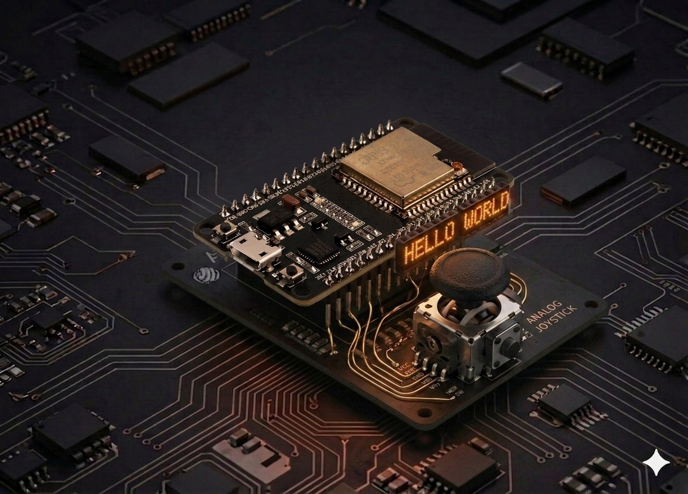

# Joystick

Un joystick analogic e, în fapt, două **potențiometre** (unul pentru axa X, altul pentru Y) plus un **buton** care se închide când apeși pe manșă. Aici îl citim cu ESP32-ul în MicroPython și folosim valorile pentru a determina direcția — fundamentul oricărei telecomenzi sau joc simplu.



## Descriere

ESP32 are un ADC pe **12 biți** — `read()` întoarce valori între `0` și `4095`. Centrul (manșa în repaus) este aproximativ `2048`. Pentru fiecare axă mapăm intervalul la o decizie: „centru" / „stânga" / „dreapta" / „sus" / „jos".

Două detalii importante pe ESP32, diferite față de Arduino:

1. **ADC2 e indisponibil când Wi-Fi e activ.** Restrânge-te la **ADC1** (GPIO 32–39). Aici folosim **GPIO 34** și **GPIO 35** — pini doar-input din ADC1.
2. **Atenuarea** schimbă plaja de tensiune citită. Implicit, ADC merge până pe la 1,1 V; setând `ADC.ATTN_11DB` extindem la ~0–3,3 V — exact ce ne trebuie pentru un joystick alimentat la 3,3 V.

## Componente

| Component | Cantitate |
|-----------|-----------|
| Placă ESP32 (DevKit V1) | 1 |
| Modul joystick analogic (KY-023 sau similar) | 1 |
| Fire jumper F-M | 5 |

## Conectare

| Pin modul | ESP32 | Note |
|-----------|-------|------|
| GND | GND | masă comună |
| +5V (sau VCC) | 3.3V | la 3,3 V joystick-ul funcționează perfect |
| VRx | GPIO 34 | axa X, ADC1 |
| VRy | GPIO 35 | axa Y, ADC1 |
| SW | GPIO 32 | buton, cu pull-up intern |

```board
    ESP32                Joystick
    3.3V ──────────── +5V / VCC
    GND ───────────── GND
    GPIO 34 ─────────── VRx  (axa X)
    GPIO 35 ─────────── VRy  (axa Y)
    GPIO 32 ─────────── SW   (buton, active LOW)
```

!!! tip "De ce 3.3 V și nu 5 V"
    GPIO-urile ESP32 nu sunt 5 V tolerante. Dacă alimentezi modulul la 5 V, vârfurile axelor depășesc 3,3 V și pot deteriora ADC-ul. La 3,3 V, joystick-ul livrează exact intervalul 0–3,3 V — perfect pentru ADC.

!!! warning "Pini de evitat"
    GPIO **34–39** sunt **doar input** (fără pull-up/down intern, fără output) — ideal pentru axe analogice. Pentru buton folosim GPIO 32 care **are pull-up intern**.

## Cod

```python
from machine import Pin, ADC
import time

# --- Configurare ---

vrx = ADC(Pin(34))
vry = ADC(Pin(35))
vrx.atten(ADC.ATTN_11DB)   # plaja completă 0-3,3 V
vry.atten(ADC.ATTN_11DB)

button = Pin(32, Pin.IN, Pin.PULL_UP)   # active LOW: 0 = apăsat

# Praguri pentru zona moartă (centru ~2048, ±35%)
DEAD_LOW = 1300
DEAD_HIGH = 2800


def read_direction():
    """Returnează 'STOP' / 'STANGA' / 'DREAPTA' / 'SUS' / 'JOS'."""
    x = vrx.read()
    y = vry.read()

    x_out = x < DEAD_LOW or x > DEAD_HIGH
    y_out = y < DEAD_LOW or y > DEAD_HIGH

    if not x_out and not y_out:
        return "STOP", x, y

    # Câștigă axa cu deflecție mai mare față de centru
    dx = x - 2048
    dy = y - 2048
    if abs(dx) >= abs(dy):
        return ("STANGA" if x < DEAD_LOW else "DREAPTA"), x, y
    else:
        return ("SUS" if y < DEAD_LOW else "JOS"), x, y


print("Mișcă joystick-ul. Ctrl+C pentru oprire.\n")

last_dir = None
while True:
    direction, x, y = read_direction()
    pressed = button.value() == 0   # 0 = apăsat

    # Afișează doar când se schimbă direcția sau butonul
    if direction != last_dir or pressed:
        print(f"X={x:4d}  Y={y:4d}  →  {direction}{'  [BUTON]' if pressed else ''}")
        last_dir = direction

    time.sleep_ms(50)
```

## Rulează scriptul

1. Conectează ESP32-ul prin USB.
2. În Thonny lipește codul și apasă **Run** (F5) — nu e nevoie să-l salvezi pe placă pentru testare.
3. Mișcă manșa în patru direcții. În consolă vei vedea ceva de tipul:

```
Mișcă joystick-ul. Ctrl+C pentru oprire.

X=2032  Y=2061  →  STOP
X= 158  Y=2052  →  STANGA
X=4093  Y=2048  →  DREAPTA
X=2050  Y=  82  →  SUS  [BUTON]
X=2048  Y=4061  →  JOS
```

Valorile exacte ale centrului variază între bucăți (490–530 e normal, dar pe ADC pe 12 biți se traduce în 1900–2150).

## Calibrare rapidă

Dacă pe placa ta centrul nu se nimerește în zona moartă, citește valorile reale în repaus și ajustează:

```python
# Lasă manșa centrată și citește 10 mostre
samples_x = [vrx.read() for _ in range(10)]
samples_y = [vry.read() for _ in range(10)]
center_x = sum(samples_x) // 10
center_y = sum(samples_y) // 10
print("Centru:", center_x, center_y)
# Apoi setează DEAD_LOW și DEAD_HIGH în jurul acestor valori.
```

## Exemplu: maparea la −100 … +100

Util pentru jocuri sau viteză proporțională:

```python
def normalize(value):
    """0..4095  →  -100..+100, cu zona moartă în jurul centrului."""
    if DEAD_LOW <= value <= DEAD_HIGH:
        return 0
    if value < DEAD_LOW:
        return -((DEAD_LOW - value) * 100) // DEAD_LOW
    return ((value - DEAD_HIGH) * 100) // (4095 - DEAD_HIGH)

while True:
    nx = normalize(vrx.read())
    ny = normalize(vry.read())
    print(f"X={nx:+4d}  Y={ny:+4d}")
    time.sleep_ms(100)
```

## Probleme frecvente

??? question "Valorile X / Y oscilează puternic chiar și când manșa stă pe loc"
    - Zgomot ADC obișnuit pe ESP32. Mediază mai multe citiri:
      ```python
      def avg(adc, n=5):
          return sum(adc.read() for _ in range(n)) // n
      ```
    - Asigură-te că alimentezi modulul de la **3.3V**, nu prin USB neîngrijit.
    - Dacă rulezi cod Wi-Fi în paralel, **nu folosi ADC2** — rămâi pe GPIO 32–39.

??? question "Butonul rămâne apăsat sau eliberat tot timpul"
    - Modulul tău are pull-up extern? Atunci scoate `Pin.PULL_UP` din cod: `Pin(32, Pin.IN)`.
    - Dacă nu se schimbă deloc, verifică firul SW — pe unele module e marcat „BTN" sau „K".

??? question "Axa pare inversată"
    - Schimbă orientarea modulului sau, în software, înlocuiește `x` cu `4095 - x` (la fel pentru `y`).

??? question "`OSError: invalid pin` la `ADC(Pin(...))`"
    - Pinul nu suportă ADC sau e pe ADC2 cu Wi-Fi activ. Folosește **34, 35, 36, 39** (ADC1, doar input) sau **32, 33** (ADC1, input/output).

## Idei de extindere

- **Servo comandat de axă:** mapează axa X la `set_angle(0..180)` din [proiectul Servomotor](servo.md).
- **LED RGB cu joystick:** X reglează roșul, Y albastrul, butonul comută verdele — combină cu [LED RGB](rgb_led.md).
- **Telecomandă wireless:** trimite (direcție, buton) cu [ESP-NOW](esp_now.md) către o a doua placă. Pentru un exemplu complet de telecomandă peste Wi-Fi, vezi [Telecomanda robot](robot_car_remote.md).
- **Joc Snake pe LCD:** axele controlează direcția unui șarpe afișat pe un LCD I2C 16×2.

---

## Referințe

- [MicroPython — `machine.ADC` reference](https://docs.micropython.org/en/latest/library/machine.ADC.html)
- [Random Nerd Tutorials — ESP32 Analog Inputs (MicroPython)](https://randomnerdtutorials.com/esp32-adc-analog-read-arduino-ide/)
