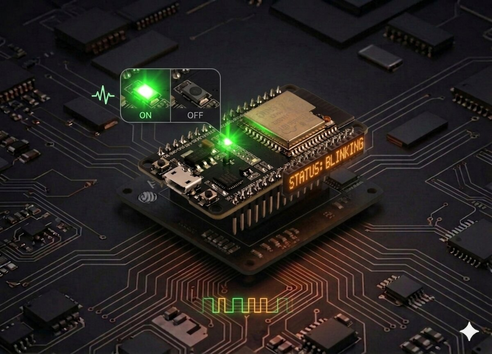

# LED Blink

Blinks the ESP32's built-in LED (GPIO 2) on and off every second using MicroPython.



## Description

This is a minimal MicroPython script that toggles the onboard LED of an ESP32 board in an infinite loop with a 1-second interval. It serves as the "Hello, World!" of embedded systems.

## Code

```python
import machine
import time

# Pin 2 is the built-in LED on most ESP32 boards
led = machine.Pin(2, machine.Pin.OUT)

while True:
    led.value(1) # Turn LED on
    time.sleep(1)
    led.value(0) # Turn LED off
    time.sleep(1)
```

## Getting Started

### Prerequisites

- ESP32 board with MicroPython firmware installed
- [Thonny IDE](https://thonny.org/) or any tool that supports uploading files to MicroPython devices (e.g., `ampy`, `rshell`, `mpremote`)

### Running the Script

**Using Thonny:**
1. Open Thonny and connect your ESP32 via USB
2. Create a new file and paste the code above
3. Save it as `main.py` on the **MicroPython device**
4. The script will run automatically on boot

## Connecting an External LED

You can connect an external LED to any available GPIO pin instead of (or in addition to) the built-in one.

### Components Needed

- 1x LED
- 1x 220–330 Ω resistor
- Jumper wires
- Breadboard

### Wiring

```board
ESP32 GPIO pin  →  Resistor (220Ω)  →  LED anode (+, longer leg)
LED cathode (-, shorter leg)  →  GND
```

Example using GPIO 4:

```board
GPIO 4  ──[220Ω]──  LED+  →  LED-  ──  GND
```

### Updating the Code

Change the pin number in your code to match the GPIO pin you wired the LED to:

```python
led = machine.Pin(4, machine.Pin.OUT)  # Replace 4 with your chosen GPIO pin
```

## LED Chaser Example

Wire several LEDs to consecutive GPIO pins and cycle through them in sequence:

```python
import machine
import time

pins = [12, 13, 14]
leds = [machine.Pin(p, machine.Pin.OUT) for p in pins]

while True:
    for led in leds:
        led.on()
        time.sleep(0.2)
        led.off()
```

### Wiring Diagram


### LED Chaser in Action


---

## Reference

- [Blink A Led With Esp32 And Micropython](https://www.electromaker.io/project/view/blink-a-led-with-esp32-and-micropython)
- [ESP32 and ESP8266 GPIO Programming with MicroPython – LED Blinking Example](https://microcontrollerslab.com/esp32-esp8266-gpio-programming-micropython-led-blinking/)
