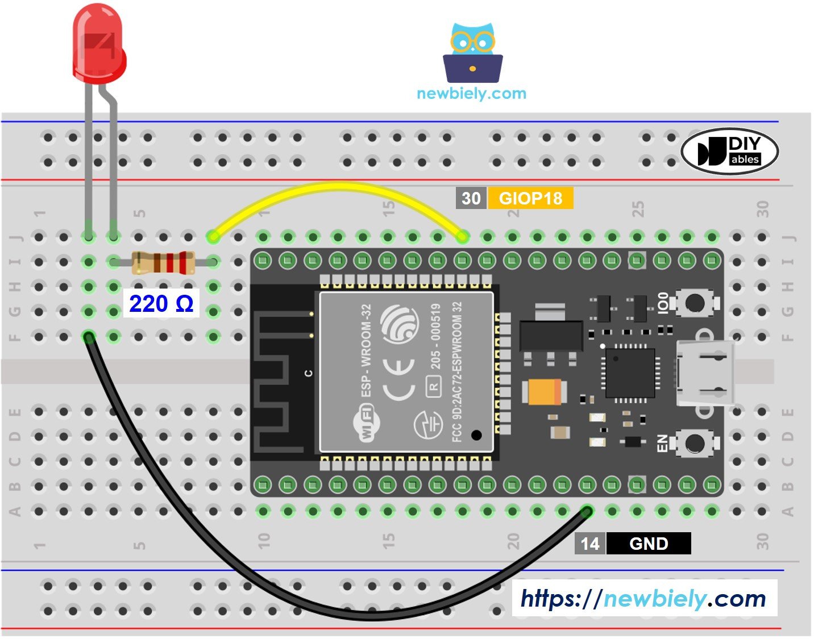
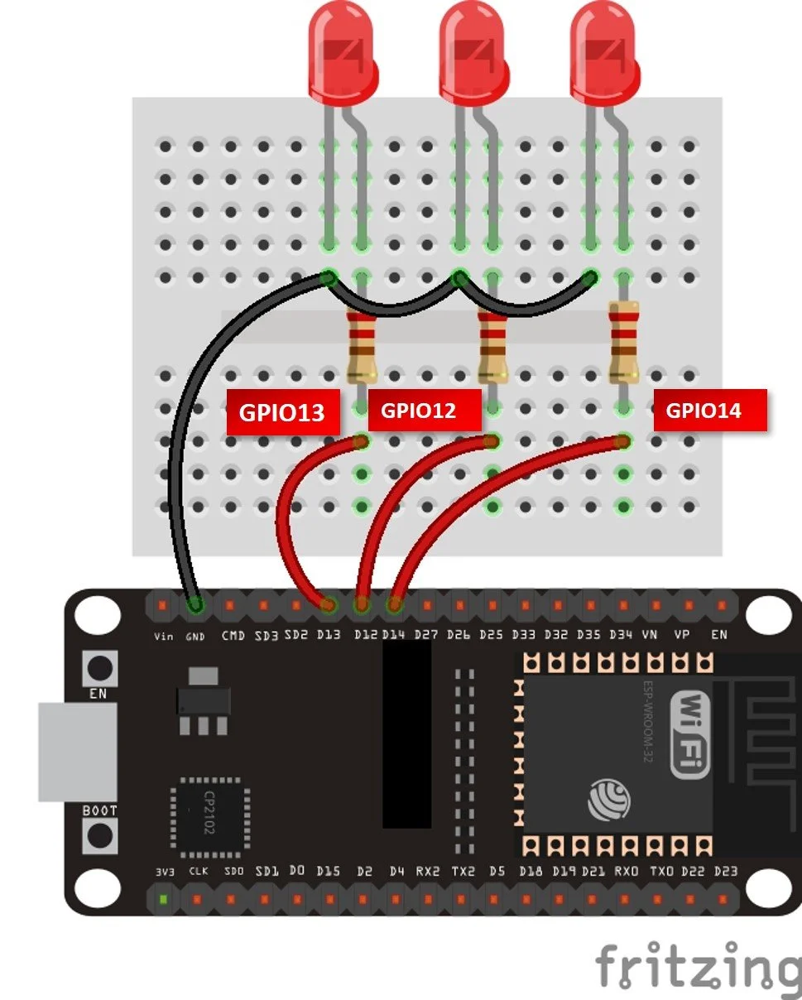

# LED intermitent

Aprinde și stinge LED-ul integrat al ESP32 (GPIO 2) la fiecare secundă folosind MicroPython.

## Descriere

Acesta este un script MicroPython minimal care comută LED-ul de la bordul unui ESP32 în buclă infinită cu un interval de 1 secundă. Reprezintă echivalentul „Hello, World!" al sistemelor integrate.

## Cod

```python
import machine
import time

# Pinul 2 este LED-ul integrat pe majoritatea plăcilor ESP32
led = machine.Pin(2, machine.Pin.OUT)

while True:
    led.value(1) # Aprinde LED-ul
    time.sleep(1)
    led.value(0) # Stinge LED-ul
    time.sleep(1)
```

## Primii pași

### Cerințe prealabile

- Placă ESP32 cu firmware MicroPython instalat
- [Thonny IDE](https://thonny.org/) sau orice instrument care suportă încărcarea fișierelor pe dispozitive MicroPython (ex.: `ampy`, `rshell`, `mpremote`)

### Rularea scriptului

**Cu Thonny:**
1. Deschide Thonny și conectează ESP32-ul prin USB
2. Creează un fișier nou și lipește codul de mai sus
3. Salvează-l ca `main.py` pe **dispozitivul MicroPython**
4. Scriptul va rula automat la pornire

## Conectarea unui LED extern

Poți conecta un LED extern la orice pin GPIO disponibil în loc de (sau în plus față de) cel integrat.

### Componente necesare

- 1x LED
- 1x rezistență de 220–330 Ω
- Fire jumper
- Breadboard

### Conectare

```board
Pin GPIO ESP32  →  Rezistență (220Ω)  →  Anod LED (+, piciorul mai lung)
Catod LED (-, piciorul mai scurt)  →  GND
```

Exemplu folosind GPIO 4:

```board
GPIO 4  ──[220Ω]──  LED+  →  LED-  ──  GND
```

### Actualizarea codului

Modifică numărul pinului din cod pentru a corespunde pinului GPIO la care ai conectat LED-ul:

```python
led = machine.Pin(4, machine.Pin.OUT)  # Înlocuiește 4 cu pinul GPIO ales
```

## Exemplu: LED-uri în cascadă

Conectează mai multe LED-uri la pini GPIO consecutivi și ciclează prin ele în ordine:

```python
import machine
import time

pins = [12, 13, 14]
leds = [machine.Pin(p, machine.Pin.OUT) for p in pins]

while True:
    for led in leds:
        led.on()
        time.sleep(0.2)
        led.off()
```

### Schemă de conectare



### LED-uri în cascadă în acțiune



---

## Referințe

- [Blink A Led With Esp32 And Micropython](https://www.electromaker.io/project/view/blink-a-led-with-esp32-and-micropython)
- [ESP32 and ESP8266 GPIO Programming with MicroPython – LED Blinking Example](https://microcontrollerslab.com/esp32-esp8266-gpio-programming-micropython-led-blinking/)
