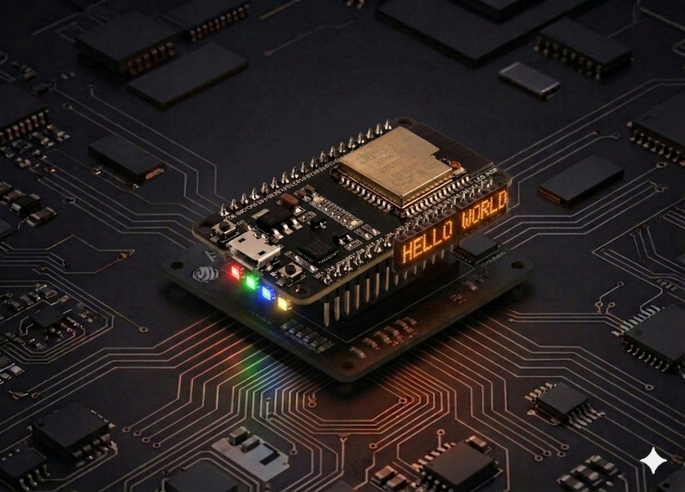

# LED RGB

Un **LED RGB** are trei LED-uri (roșu, verde, albastru) într-o singură carcasă. Pe ESP32, controlăm intensitatea fiecăruia cu **PWM** și putem genera aproape orice culoare din spectrul vizibil. Codul rulează în MicroPython.



## Descriere

ESP32 are un controller LED PWM intern care îți dă **până la 16 canale** independente. Pentru un LED RGB folosim 3 canale, câte unul pentru fiecare culoare. Variind ciclul (`duty`) între 0 și 1023, ochiul percepe o intensitate continuă — exact ca `analogWrite` pe Arduino, doar că aici rezoluția implicită este 10 biți (0–1023), nu 8 biți (0–255).

## Componente

| Component | Cantitate |
|-----------|-----------|
| Placă ESP32 (DevKit V1 sau similar) | 1 |
| LED RGB (catod comun) | 1 |
| Rezistență 220 Ω | 3 |
| Breadboard | 1 |
| Fire jumper M-M | 4 |

## Cum funcționează

Un LED RGB are **4 picioare**:

- 3 anozi (+): roșu, verde, albastru — câte unul pentru fiecare culoare.
- 1 catod (−) comun — cel mai lung picior, se conectează la GND.

Fiecare anod are nevoie de **propria rezistență de 220 Ω** ca să limiteze curentul.

### PWM pe ESP32

Spre deosebire de Arduino UNO (unde doar pinii marcați cu `~` suportă PWM), pe ESP32 **aproape orice GPIO** poate fi pin PWM, fiindcă controller-ul intern atribuie automat un canal hardware. În MicroPython:

```python
from machine import Pin, PWM
ch = PWM(Pin(25), freq=1000, duty=512)   # 50% intensitate
ch.duty(0)      # stins
ch.duty(1023)   # maxim
```

Combinații tipice `(R, G, B)` (la rezoluție 1023):

- `(1023, 0, 0)` → roșu pur
- `(0, 1023, 0)` → verde pur
- `(1023, 1023, 0)` → galben
- `(1023, 1023, 1023)` → alb
- `(512, 0, 1023)` → mov

## Conectare

Folosim **GPIO 25, 26, 27** — sunt liberi pe orice DevKit V1 și suportă PWM fără conflicte.

| Pin LED RGB | ESP32 |
|-------------|-------|
| R (roșu)    | GPIO 25 (prin 220 Ω) |
| G (verde)   | GPIO 26 (prin 220 Ω) |
| B (albastru)| GPIO 27 (prin 220 Ω) |
| Catod comun (−) | GND |

```board
    ESP32             LED RGB (catod comun)
   GPIO 25 ──[220Ω]──── R
   GPIO 26 ──[220Ω]──── G
   GPIO 27 ──[220Ω]──── B
      GND ─────────── Catod (−, piciorul cel mai lung)
```

!!! warning "Pini de evitat"
    GPIO **6–11** sunt folosiți pentru memoria SPI flash internă — nu îi conecta. GPIO **34–39** sunt doar de intrare, nu suportă PWM. GPIO 0, 2, 12, 15 au funcții speciale la pornire — pot funcționa, dar pot și împiedica boot-ul dacă LED-ul trage prea mult curent.

## Cod

```python
from machine import Pin, PWM
import time

# --- Configurare ---

# Pini PWM pentru cele trei canale RGB
red   = PWM(Pin(25), freq=1000, duty=0)
green = PWM(Pin(26), freq=1000, duty=0)
blue  = PWM(Pin(27), freq=1000, duty=0)

DELAY_MS = 10  # cât de lent face fade


def set_color(r, g, b):
    """Setează culoarea LED-ului. Valori 0-1023."""
    red.duty(r)
    green.duty(g)
    blue.duty(b)


def fade(from_color, to_color, steps=255, delay_ms=DELAY_MS):
    """Tranziție lină între două culori (tuple-uri R, G, B)."""
    fr, fg, fb = from_color
    tr, tg, tb = to_color
    for i in range(steps + 1):
        r = fr + (tr - fr) * i // steps
        g = fg + (tg - fg) * i // steps
        b = fb + (tb - fb) * i // steps
        set_color(r, g, b)
        time.sleep_ms(delay_ms)


RED   = (1023, 0, 0)
GREEN = (0, 1023, 0)
BLUE  = (0, 0, 1023)
OFF   = (0, 0, 0)

try:
    while True:
        fade(RED, GREEN)
        fade(GREEN, BLUE)
        fade(BLUE, RED)

except KeyboardInterrupt:
    # La oprire, stinge LED-ul ca să nu rămână aprins
    set_color(0, 0, 0)
    red.deinit()
    green.deinit()
    blue.deinit()
```

## Rulează scriptul

1. Conectează ESP32-ul prin USB și deschide Thonny.
2. Lipește codul de mai sus și salvează-l ca `main.py` pe **dispozitivul MicroPython** (ca să pornească automat la fiecare reboot).
3. Apasă **Run** (F5). LED-ul ar trebui să cicleze lent prin roșu → verde → albastru → roșu, fiecare tranziție în ~2,5 secunde.

Dacă LED-ul nu reacționează, vezi secțiunea [Probleme frecvente](#probleme-frecvente).

## Exemplu: o singură culoare fixă

```python
from machine import Pin, PWM

red   = PWM(Pin(25), freq=1000)
green = PWM(Pin(26), freq=1000)
blue  = PWM(Pin(27), freq=1000)

# Mov pal (R=200, G=0, B=512)
red.duty(200)
green.duty(0)
blue.duty(512)
```

## Exemplu: culoare aleatoare la fiecare secundă

```python
from machine import Pin, PWM
import random
import time

channels = [PWM(Pin(p), freq=1000) for p in (25, 26, 27)]

while True:
    for ch in channels:
        ch.duty(random.randint(0, 1023))
    time.sleep(1)
```

## Probleme frecvente

??? question "LED-ul nu se aprinde deloc"
    - Verifică **catodul comun** — piciorul cel mai lung trebuie la GND.
    - Confirmă **rezistența pe fiecare anod** (220 Ω) — fără ele LED-ul se poate arde sau, dacă alimentarea e marginală, nu se aprinde.
    - Schimbă firul USB — unele cabluri „doar alimentare" nu transmit suficient curent.

??? question "O culoare e mult mai intensă decât celelalte"
    - Asta e normal — LED-urile roșii folosesc 1,8 V iar verzii/albaștrii 3,0–3,2 V; la aceeași rezistență, roșul apare mai luminos. Compensează în software: `red.duty(int(value * 0.6))`.

??? question "Mi-am cumpărat un LED cu anod comun"
    - Inversează logica: `0` înseamnă maxim, `1023` înseamnă stins. Înlocuiește `set_color`:
      ```python
      def set_color(r, g, b):
          red.duty(1023 - r)
          green.duty(1023 - g)
          blue.duty(1023 - b)
      ```
    - Conectează piciorul cel mai lung la **3,3 V**, nu la GND.

??? question "`OSError: invalid pin` la `PWM(Pin(...))`"
    - Pinul ales nu suportă PWM (ex. GPIO 34–39 sunt doar input). Folosește alți pini — recomandate: 25, 26, 27, 32, 33.

## Idei de extindere

- **Buton care schimbă moduri:** un buton pe GPIO 32 ciclează între „solid", „fade RGB", „aleator".
- **Citire potențiometru:** trei potențiometre pe ADC1 (GPIO 36, 39, 34) reglează manual fiecare canal.
- **Mood-light cu DHT22:** culoarea reflectă temperatura (albastru < 20 °C, verde 20–25 °C, roșu > 25 °C) — combină cu [proiectul DHT22](temperature.md).
- **Sincronizare wireless:** trimite valoarea culorii cu [ESP-NOW](esp_now.md) — o placă-master comandă culoarea pe mai multe LED-uri RGB simultan.

---

## Referințe

- [MicroPython — `machine.PWM` reference](https://docs.micropython.org/en/latest/library/machine.PWM.html)
- [Random Nerd Tutorials — ESP32 PWM with MicroPython](https://randomnerdtutorials.com/esp32-pwm-with-micropython-fading-leds/)
