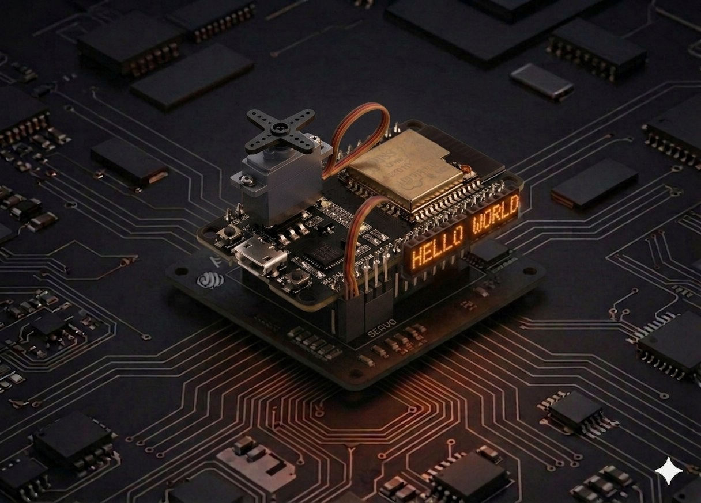

# Servomotor

Un servomotor este un motor mic cu angrenaje care se oprește la un unghi precis — exact ce ai nevoie pentru un braț robotizat, direcția unei mașinuțe sau un capac care se deschide singur. Aici îl comandăm de pe ESP32, în MicroPython, prin PWM la 50 Hz.



## Descriere

Un servo „de hobby" (SG90, MG90, SG5010) așteaptă un puls **scurt repetat la fiecare 20 ms** pe firul de semnal. Lungimea pulsului decide unghiul:

- ~0,5 ms → 0°
- ~1,5 ms → 90° (centru)
- ~2,4 ms → 180°

Pe ESP32 nu există o bibliotecă „Servo" încorporată ca pe Arduino — folosim direct `machine.PWM` la 50 Hz și calculăm `duty` în funcție de unghi. La rezoluție de 10 biți (0–1023), un puls de 1 ms revine la `duty ≈ 51`, iar unul de 2 ms la `duty ≈ 102`.

## Componente

| Component | Cantitate |
|-----------|-----------|
| Placă ESP32 (DevKit V1) | 1 |
| Servomotor SG90 (9 g) | 1 |
| Fire jumper M-M | 3 |
| Sursă externă 5 V (recomandat pentru 2+ servo) | după caz |

### Specificații SG90

- Tensiune de lucru: 4,8 – 6 V
- Cuplu: ~1,6 kg·cm la 4,8 V
- Viteză: ~0,12 s / 60°

## Conectare

| Fir servo | Culoare | ESP32 |
|-----------|---------|-------|
| GND (−) | maro / negru | GND |
| V+ | roșu | Vin / 5V (vezi nota) |
| Semnal | portocaliu / galben | GPIO 13 |

```board
    ESP32                Servo SG90
   GPIO 13 ──── portocaliu ── Semnal
     5V / Vin ── roșu       ── Putere (+)
     GND ────── maro        ── Masă (−)
```

!!! warning "Alimentarea servo-ului"
    SG90 vrea **5 V**. Pinul `3.3V` al ESP32 nu e suficient — la mișcare cuplul scade vizibil și placa se poate reseta din cauza vârfurilor de curent. Folosește pinul **Vin** (= 5 V când placa e alimentată prin USB) pentru un singur servo, sau o sursă externă 5 V cu masa comună cu ESP32 pentru 2 sau mai multe servo-uri. **Niciodată nu alimenta servo-ul direct din 3.3V.**

## Cod

```python
from machine import Pin, PWM
import time

# --- Configurare ---

SERVO_PIN = 13
FREQ = 50          # 50 Hz = perioadă 20 ms (cerută de servo)

# Duty pentru SG90 la rezoluție 10 biți:
#   0°   → puls 0,5 ms  → duty ≈ 26
#   90°  → puls 1,5 ms  → duty ≈ 77
#   180° → puls 2,4 ms  → duty ≈ 123
DUTY_MIN = 26
DUTY_MAX = 123

servo = PWM(Pin(SERVO_PIN), freq=FREQ, duty=0)


def set_angle(angle):
    """Setează unghiul servo-ului între 0 și 180 grade."""
    angle = max(0, min(180, angle))                    # limitează
    duty = DUTY_MIN + (DUTY_MAX - DUTY_MIN) * angle // 180
    servo.duty(duty)


def sweep():
    """Baleiere lentă 0° → 180° → 0°."""
    for a in range(0, 181, 2):
        set_angle(a)
        time.sleep_ms(15)
    for a in range(180, -1, -2):
        set_angle(a)
        time.sleep_ms(15)


try:
    while True:
        sweep()
except KeyboardInterrupt:
    set_angle(90)        # parchează la centru
    time.sleep_ms(500)
    servo.deinit()
```

## Rulează scriptul

1. Conectează ESP32-ul prin USB.
2. În Thonny, lipește codul și salvează-l ca `main.py` pe **dispozitivul MicroPython**.
3. Apasă **Run** (F5). Axul servo-ului trebuie să facă o baleiere lentă din 0° în 180° și înapoi.

Dacă servo-ul „țâșnește" și apoi se oprește brusc, vezi [Probleme frecvente](#probleme-frecvente).

## Calibrare

Servo-urile ieftine variază între bucăți — SG90-ul tău poate avea capete reale la 5°…175° în loc de 0°…180°. Dacă vezi că la `angle=0` se aude un bâzâit (axul lovește capătul mecanic), ridică `DUTY_MIN` cu 2-3 unități. Dacă la `angle=180` nu ajunge până la capăt, mărește `DUTY_MAX`.

```python
# Testează capetele înainte să folosești sweep()
set_angle(0)     # ar trebui să meargă lin la stânga
time.sleep(1)
set_angle(180)   # apoi la dreapta
```

## Exemplu: poziție de la consolă

Trimite un unghi din REPL-ul Thonny și servo-ul se duce direct acolo:

```python
from machine import Pin, PWM

servo = PWM(Pin(13), freq=50)
DUTY_MIN, DUTY_MAX = 26, 123

def set_angle(a):
    a = max(0, min(180, a))
    servo.duty(DUTY_MIN + (DUTY_MAX - DUTY_MIN) * a // 180)

# În REPL: set_angle(45), set_angle(120), etc.
```

## Probleme frecvente

??? question "Servo-ul tremură fără să primească comandă"
    - Vârfuri de curent. Asigură-te că alimentezi din **Vin / 5V**, nu din 3.3V.
    - Adaugă un **condensator de 100 µF** între V+ și GND, lângă servo.
    - Pentru 2+ servo-uri, folosește o sursă externă 5 V și conectează GND-ul ei cu GND-ul ESP32.

??? question "ESP32-ul se resetează când servo-ul începe să se miște"
    - Curentul de pornire al servo-ului trage tensiunea sub pragul de reset. Folosește alimentare externă, nu USB.

??? question "Axul lovește mecanic capătul (se aude un bâzâit)"
    - Comanzi un unghi în afara intervalului real. Vezi secțiunea [Calibrare](#calibrare) — restrânge `DUTY_MIN` / `DUTY_MAX`.

??? question "Servo-ul se mișcă invers față de ce mă aștept"
    - Schimbă maparea: înlocuiește `angle` cu `180 - angle` în `set_angle()`.

??? question "`OSError: invalid pin` la `PWM(Pin(...))`"
    - Pinul ales nu poate face PWM (ex. GPIO 34–39 sunt input-only). Mută semnalul pe GPIO **13, 14, 25, 26, 27, 32, 33**.

## Idei de extindere

- **Joystick → servo:** citește un potențiometru pe GPIO 34 (ADC1) și mapează 0–4095 la 0–180°. Vezi [Telecomanda robot](robot_car_remote.md) pentru un exemplu complet de joystick pe ADC.
- **Pan/tilt cu două servo-uri:** un servo orizontal + unul vertical, montate pe un mic suport — bază pentru o cameră care urmărește un obiect.
- **Brățara mecanică a robotului:** combină cu [LED-ul RGB](rgb_led.md) ca să afișezi starea (verde = idle, roșu = în mișcare).
- **Comandă wireless:** trimite unghiul cu [ESP-NOW](esp_now.md) de la o telecomandă — fără cabluri, fără Wi-Fi.

---

## Referințe

- [MicroPython — `machine.PWM` reference](https://docs.micropython.org/en/latest/library/machine.PWM.html)
- [Random Nerd Tutorials — ESP32 with Servo Motor (MicroPython)](https://randomnerdtutorials.com/esp32-servo-motor-web-server-arduino-ide/)
