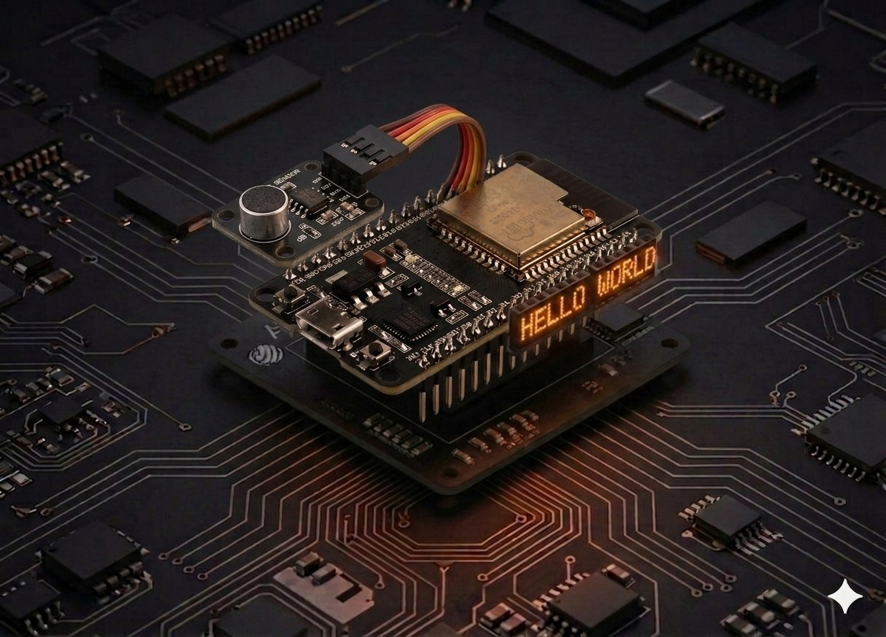

# Sound sensor

The KY-038 sound module (or similar LM393-based board) lets the ESP32 "hear" its surroundings: continuous level on the analog output, plus a digital comparator that fires when the sound crosses a tunable threshold. Great for clap detection, "clap-on" lamps, VU meters, or voice-activated triggers.



## Description

On the module you'll find an **electret condenser microphone** — a small capsule whose diaphragm vibrates with sound pressure. An **LM393** comparator amplifies the signal and compares it against a threshold set by the on-board pot.

The module exposes **two signals**:

- **AO** (Analog Out) — voltage proportional to sound intensity in real time. Useful for VU meters, level logging, proportional triggers.
- **DO** (Digital Out) — `0` when the sound crosses the threshold, `1` while quiet (active LOW). Useful for on/off alarm-style detection.

!!! tip "Two LEDs on the module"
    The red **PWR** LED confirms power. The second LED, usually labeled **L1** or **DO**, lights up when DO goes LOW (sound detected). Use it to calibrate the threshold: turn the pot until it goes dark in silence.

## Components

| Component | Quantity |
|-----------|----------|
| ESP32 board (DevKit V1) | 1 |
| Sound sensor module (KY-038 or similar, LM393-based) | 1 |
| F-M jumper wires | 4 |

## Wiring

| Module pin | ESP32 | Notes |
|------------|-------|-------|
| VCC (or +) | 3.3V | 3.3 V is perfectly fine — no voltage issues for the ESP32 |
| GND (or −) | GND | shared ground |
| AO | GPIO 34 | analog output, ADC1 |
| DO | GPIO 35 | digital output, read as input |

```board
    ESP32                Sound sensor
    3.3V ──────────── VCC
    GND ───────────── GND
    GPIO 34 ◄────────── AO  (analog)
    GPIO 35 ◄────────── DO  (digital)
```

!!! warning "Power at 3.3 V, not 5 V"
    Many modules are labeled "5 V" but run happily at 3.3 V. That matters for the ESP32: its GPIOs are **not 5 V tolerant**, so powering the sensor at 5 V can put 5 V on AO/DO → risky for the GPIO. At 3.3 V the outputs stay in the safe range.

!!! note "Input-only pins"
    GPIO **34** and **35** are **input-only** on the ESP32 — perfect for reading sensor outputs, you cannot drive them. They're also on ADC1, so they keep working even with Wi-Fi active (ADC2 doesn't).

## Code

```python
from machine import Pin, ADC
import time

# --- Setup ---

ao = ADC(Pin(34))
ao.atten(ADC.ATTN_11DB)          # full 0-3.3 V range

do = Pin(35, Pin.IN)             # module's digital output

# Software threshold for AO (0-4095). Calibrate to your room's quiet level.
ANALOG_THRESHOLD = 2500


def read_sound():
    """Return (analog_level, noisy_flag)."""
    level = ao.read()
    # DO is active LOW: 0 = sound above the pot's threshold
    digital_noise = (do.value() == 0)
    return level, digital_noise


print("Sound sensor running. Ctrl+C to stop.\n")

while True:
    try:
        level, noisy = read_sound()
        analog_noise = level > ANALOG_THRESHOLD

        flag = ""
        if noisy or analog_noise:
            flag = "  [NOISE]"

        print(f"AO = {level:4d}   DO = {'LOW (sound)' if noisy else 'HIGH (quiet)'}{flag}")
        time.sleep_ms(50)
    except KeyboardInterrupt:
        print("\nStop.")
        break
```

## Run the script

1. Assemble the circuit: VCC to 3.3V, GND to GND, AO to GPIO 34, DO to GPIO 35.
2. In Thonny, paste the code and press **Run** (F5).
3. Clap once — the console shows something like:

```
AO =  812   DO = HIGH (quiet)
AO =  834   DO = HIGH (quiet)
AO = 3902   DO = LOW (sound)  [NOISE]
AO = 4061   DO = LOW (sound)  [NOISE]
AO = 1284   DO = HIGH (quiet)
```

## Calibration

### Digital threshold (on-board pot)

Turn the **blue pot** on the module with a small screwdriver:

1. Make the room quiet.
2. Watch the second LED (`DO` / `L1`). In silence it should be **off**.
3. If it's on, rotate the pot (these are usually 10+ turn precision pots) until it goes dark.
4. Clap to test — the LED should blink with each sound.

### Analog threshold (software)

Read AO with your room's background noise and set `ANALOG_THRESHOLD` to `idle_value + 1500`. Quick recipe:

```python
# Average 50 readings during silence
samples = [ao.read() for _ in range(50)]
baseline = sum(samples) // len(samples)
print("Quiet:", baseline)
ANALOG_THRESHOLD = baseline + 1500
```

## Example: blink LED on a clap

The onboard LED (GPIO 2) lights up for 1 second on every detected sound:

```python
from machine import Pin, ADC
import time

ao = ADC(Pin(34)); ao.atten(ADC.ATTN_11DB)
do = Pin(35, Pin.IN)
led = Pin(2, Pin.OUT)

led_off_at = 0

while True:
    if do.value() == 0:                      # sound detected
        led.value(1)
        led_off_at = time.ticks_add(time.ticks_ms(), 1000)

    if led.value() == 1 and time.ticks_diff(led_off_at, time.ticks_ms()) <= 0:
        led.value(0)

    time.sleep_ms(20)
```

## Example: clap-clap toggle

Toggle the LED only on **two claps** within a short window — the classic "clap-on" lamp:

```python
from machine import Pin
import time

do = Pin(35, Pin.IN)
led = Pin(2, Pin.OUT)

last_clap = 0
state = False

while True:
    if do.value() == 0:                      # sound detected
        now = time.ticks_ms()
        if 100 < time.ticks_diff(now, last_clap) < 800:
            state = not state                # two claps in 0.1-0.8 s
            led.value(state)
        last_clap = now
        time.sleep_ms(200)                   # debounce — ignore echoes
    time.sleep_ms(10)
```

`100 < dt < 800` rejects both close echoes (under 100 ms — the same sound firing twice) and long pauses (over 800 ms — uncorrelated claps).

## Troubleshooting

??? question "The sensor triggers constantly, even without sound"
    - The pot threshold is too low. Turn it down (in silence) until the `DO` LED goes dark.
    - The mic is picking up steady noise — fridge, computer fan, A/C. Move the sensor.
    - Table vibrations propagate through stiff wires. Place the module on foam or something soft.

??? question "The sensor doesn't react at all"
    - Check power: the `PWR` LED must be lit.
    - The threshold is too high — turn the pot the other way.
    - Sound isn't reaching the mic — point the diaphragm at the source.
    - Electret mics are directional; don't lay the module face-down on the bench.

??? question "AO swings between 0 and 4095 even in silence"
    - Cables are too long or noisy. Use short wires (under 20 cm).
    - The module is too close to the ESP32 Wi-Fi antenna — separate them by 5-10 cm.
    - Average several readings to stabilize the value:
      ```python
      level = sum(ao.read() for _ in range(8)) // 8
      ```

??? question "I want decibels, not just a level"
    - KY-038 modules are not calibrated for dB. For real SPL you need dedicated modules (e.g. **MAX9814** with AGC) or an **I2S** microphone (INMP441, SPH0645) with FFT processing — significantly more complex.

## Extension ideas

- **Trigger a servo** ([Servo](servo.md)) on a clap — a lid that opens to sound.
- **Drive an RGB LED color** ([RGB LED](rgb_led.md)) by real-time sound level — green for quiet, red for loud.
- **Web server with live level:** extend the [Temperature Web Server](temperature_web.md) project, replacing the DHT22 read with an AO read.
- **Remote clap detection:** ship the events over [ESP-NOW](esp_now.md) to a master board that counts claps across multiple rooms.

---

## References

- [MicroPython — `machine.ADC` reference](https://docs.micropython.org/en/latest/library/machine.ADC.html)
- [LM393 datasheet (Texas Instruments)](https://www.ti.com/product/LM393)
- [Random Nerd Tutorials — ESP32 Sound Sensor](https://randomnerdtutorials.com/esp32-microphone-sensor-arduino-ide/)
