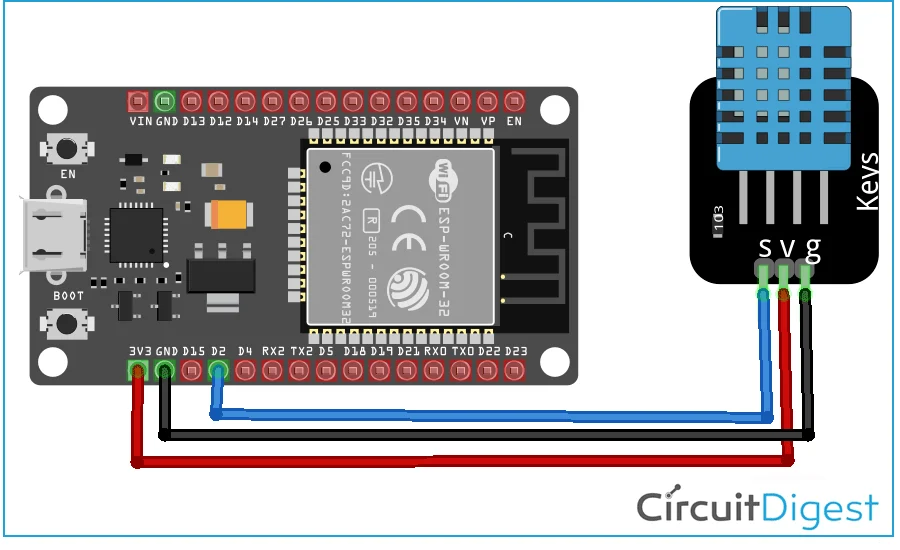
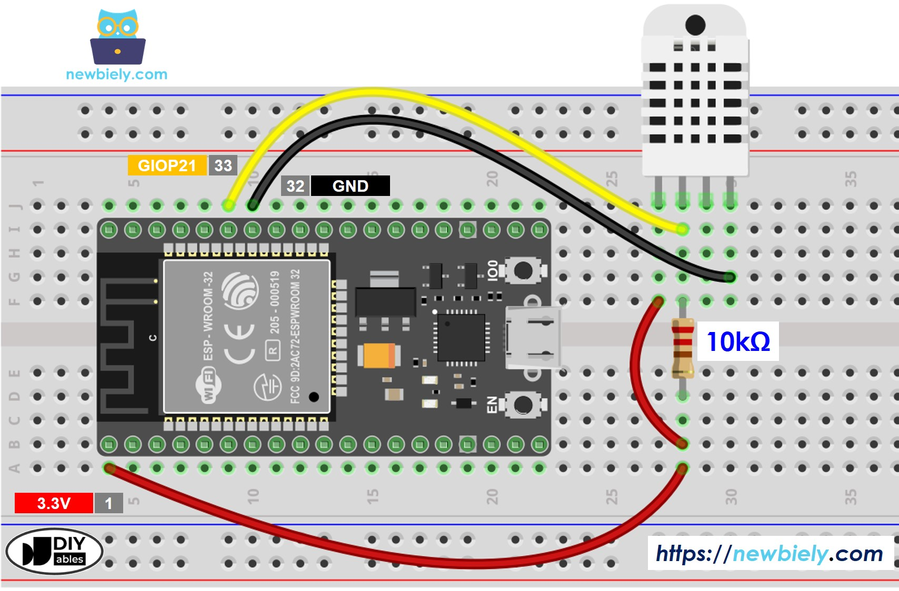

# Temperature and Humidity

Reads temperature and humidity from a DHT22 (or DHT11) sensor connected to an ESP32 and prints the values to the serial console every 2 seconds using MicroPython.


## Description

This script uses the built-in `dht` MicroPython library to communicate with a DHT22 sensor over a single data pin (GPIO 14). It reads the temperature in Celsius, converts it to Fahrenheit, and reads the relative humidity, printing all three values in a loop.

## Code

```python
from machine import Pin
from time import sleep
import dht

# DHT22 on GPIO 14
sensor = dht.DHT22(Pin(14))

# Uncomment for DHT11
# sensor = dht.DHT11(Pin(14))

while True:
  try:
    sleep(2)
    sensor.measure()
    temp = sensor.temperature()
    hum = sensor.humidity()
    temp_f = temp * (9/5) + 32.0
    print('Temperature: %3.1f C' %temp)
    print('Temperature: %3.1f F' %temp_f)
    print('Humidity: %3.1f %%' %hum)
  except OSError as e:
    print('Failed to read sensor.')
```

## Wiring

### DHT22 (or DHT11) to ESP32

```board
DHT22 Pin  →  ESP32
---------     -----
VCC (1)    →  3.3V
DATA (2)   →  GPIO 14
GND (4)    →  GND
```

A 10 kΩ pull-up resistor between DATA and VCC is recommended for reliable communication.

```board
3.3V ──[10kΩ]──┬── GPIO 14
               │
              DATA pin of sensor
```

> **DHT11 vs DHT22:** The DHT11 has lower accuracy (±2°C, ±5% RH) and a narrower range. The DHT22 is more precise (±0.5°C, ±2–5% RH) and supports a wider temperature range.

### Wiring Diagrams





---

## Reference

- [ESP32 Based Webserver for Temperature and Humidity Measurement using DHT11 Sensor](https://circuitdigest.com/microcontroller-projects/esp32-webserver-for-temperature-and-humidity-measurement-using-dht11-sensor)
- [ESP32 MicroPython DHT22 Temperature Humidity Sensor](https://newbiely.com/tutorials/esp32-micropython/esp32-micropython-dht22-temperature-humidity-sensor)
