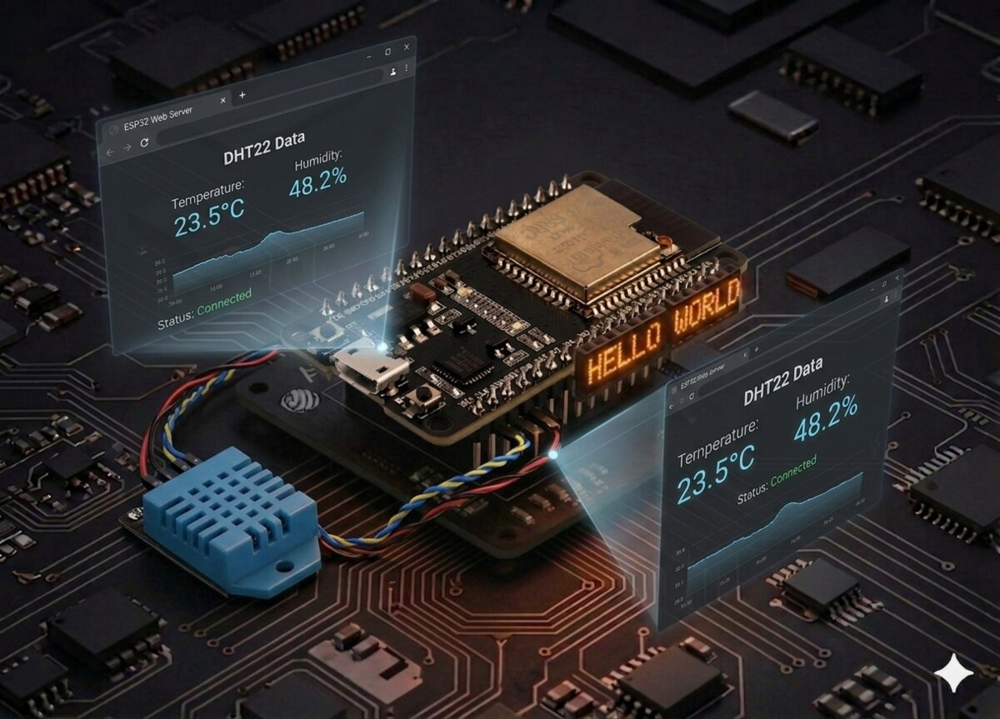

# Server web pentru temperatură și umiditate

Citește temperatura și umiditatea de la un senzor DHT22 (sau DHT11) conectat la un ESP32 și servește valorile printr-o pagină web HTTP simplă folosind MicroPython.



## Descriere

Proiectul constă dintr-un singur fișier `main.py` care:

1. Conectează ESP32-ul la rețeaua Wi-Fi.
2. Inițializează senzorul DHT11/DHT22.
3. Deschide un socket TCP pe portul 80.
4. Așteaptă conexiuni HTTP și răspunde cu o pagină HTML stilizată care afișează citirile curente ale senzorului.

## Cod

```python
import network
import time
from machine import Pin
import dht
try:
  import usocket as socket
except:
  import socket

# Configurare
ssid = 'INLOCUIESTE_CU_SSID_TAU'
password = 'INLOCUIESTE_CU_PAROLA_TA'

# Conectare la Wi-Fi
station = network.WLAN(network.STA_IF)
station.active(True)
station.connect(ssid, password)

while not station.isconnected():
  print('Se asteapta conexiunea...')
  time.sleep(1)

print('Conexiune reusita')
print(station.ifconfig())

# Configurare senzor
sensor = dht.DHT11(Pin(4))
# sensor = dht.DHT22(Pin(4))

def read_sensor():
  try:
    sensor.measure()
    temp = sensor.temperature()
    hum = sensor.humidity()
    return temp, hum
  except OSError as e:
    print('Eroare la citirea senzorului.')
    return 0, 0

def web_page(temp, hum):
  html = f"""<!DOCTYPE HTML><html>
<head>
  <meta name="viewport" content="width=device-width, initial-scale=1">
  <link rel="stylesheet" href="https://use.fontawesome.com/releases/v5.7.2/css/all.css">
  <style>
    html {{ font-family: Arial; display: inline-block; margin: 0px auto; text-align: center; }}
    h2 {{ font-size: 3.0rem; }}
    p {{ font-size: 3.0rem; }}
    .units {{ font-size: 1.2rem; }}
    .dht-labels{{ font-size: 1.5rem; vertical-align:middle; padding-bottom: 15px; }}
  </style>
</head>
<body>
  <h2>Server DHT ESP32</h2>
  <p>
    <i class="fas fa-thermometer-half" style="color:#059e8a;"></i>
    <span class="dht-labels">Temperatura</span>
    <span>{temp}</span>
    <sup class="units">&deg;C</sup>
  </p>
  <p>
    <i class="fas fa-tint" style="color:#00add6;"></i>
    <span class="dht-labels">Umiditate</span>
    <span>{hum}</span>
    <sup class="units">%</sup>
  </p>
</body>
</html>"""
  return html

s = socket.socket(socket.AF_INET, socket.SOCK_STREAM)
s.bind(('', 80))
s.listen(5)

while True:
  conn, addr = s.accept()
  print('Conexiune primita de la %s' % str(addr))
  request = conn.recv(1024)
  temp, hum = read_sensor()
  response = web_page(temp, hum)
  conn.send('HTTP/1.1 200 OK\n')
  conn.send('Content-Type: text/html\n')
  conn.send('Connection: close\n\n')
  conn.sendall(response)
  conn.close()
```

## Conectare

### DHT22 (sau DHT11) la ESP32

```board
Pin DHT22  →  ESP32
---------     -----
VCC (1)    →  3.3V
DATA (2)   →  GPIO 4
GND (4)    →  GND
```

### Schemă de conectare


---

## Referințe

- [016 - ESP32 MicroPython: Web Server | ESP32 Access Point](https://techtotinker.com/016-esp32-micropython-web-server-esp32-access-point-mode-in-micropython/)
