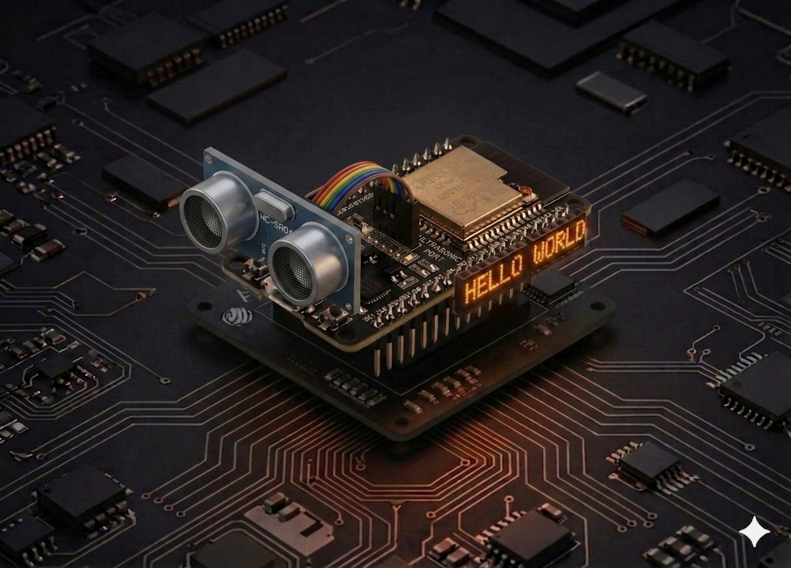

# Senzor ultrasonic

HC-SR04 este senzorul standard pentru „cât de departe e obiectul în fața mea?". Îl găsești în roboții care evită obstacole, în sistemele de parcare și în alarme de prezență. Aici îl conectăm la ESP32 și citim distanța în MicroPython folosind `machine.time_pulse_us`.



## Descriere

Senzorul HC-SR04 are 4 pini: `VCC`, `Trig`, `Echo`, `GND`. Principiul de funcționare e identic cu cel al liliecilor:

1. ESP32 dă un puls `HIGH` de **10 microsecunde** pe pinul `Trig`.
2. Senzorul emite 8 cicluri de ultrasunet la **40 kHz** (inaudibil pentru om).
3. Când ultrasunetul lovește un obstacol, se întoarce ca ecou.
4. Pinul `Echo` rămâne `HIGH` exact cât durează drumul dus-întors al sunetului.
5. ESP32 cronometrează durata pulsului cu `time_pulse_us` și calculează distanța.

### Calculul distanței

Sunetul se propagă în aer cu ~**343 m/s** = 0,0343 cm/µs. Pentru că durata măsurată reprezintă drumul dus-întors, împărțim la 2:

```
distanță [cm] = durată [µs] × 0,0343 / 2
```

Sau, echivalent: `durată / 58,3`.

**Domeniu util:** 2 cm – 400 cm, cu precizie de ~3 mm.

## Componente

| Component | Cantitate |
|-----------|-----------|
| Placă ESP32 (DevKit V1) | 1 |
| Modul HC-SR04 (sau HC-SR04**P** — varianta 3,3 V) | 1 |
| Rezistență 1 kΩ | 1 (numai pentru HC-SR04 clasic) |
| Rezistență 2 kΩ | 1 (numai pentru HC-SR04 clasic) |
| Fire jumper F-M | 4 |

!!! warning "HC-SR04 trimite 5 V pe Echo — ESP32 acceptă doar 3,3 V"
    Modulul **HC-SR04 clasic** este alimentat la 5 V și scoate **5 V** pe pinul Echo. Pinii ESP32 nu sunt 5 V tolerant — conectarea directă poate strica GPIO-ul în timp. Două variante:

    - **Recomandat:** folosește versiunea **HC-SR04P** (sau HC-SR04+), care funcționează la 3,3 V — fără rezistențe, conexiune directă.
    - **Cu HC-SR04 clasic:** pune un **divizor de tensiune** pe Echo (1 kΩ + 2 kΩ) ca să cobori 5 V → 3,3 V. Trig poate rămâne conectat direct, fiindcă ESP32 trimite 3,3 V iar HC-SR04 îl interpretează ca HIGH.

## Conectare

| Pin senzor | ESP32 |
|------------|-------|
| VCC | Vin / 5V (HC-SR04 clasic) **sau** 3.3V (HC-SR04P) |
| GND | GND |
| Trig | GPIO 5 |
| Echo | GPIO 18 (prin divizor de tensiune, vezi mai jos) |

### Divizor de tensiune pentru Echo (HC-SR04 clasic)

```board
   Echo (5 V) ──[ 1 kΩ ]──┬── GPIO 18 (3,3 V)
                           │
                          [ 2 kΩ ]
                           │
                          GND
```

`V_out = V_in × 2 / (1 + 2) = 5 × 2/3 ≈ 3,3 V` — exact pragul ESP32-ului.

### Schemă completă

```board
    ESP32                   HC-SR04
    Vin / 5V ────────── VCC
    GND ────────────── GND
    GPIO 5 ──────────── Trig
    GPIO 18 ◄─[1 kΩ]─── Echo
                    └──[2 kΩ]──── GND
```

## Cod

```python
from machine import Pin, time_pulse_us
import time

# --- Configurare ---

trig = Pin(5, Pin.OUT)
echo = Pin(18, Pin.IN)


def measure_distance_cm(timeout_us=30_000):
    """Returnează distanța în cm sau None dacă nu s-a primit ecou."""
    # Asigură-te că Trig pleacă de la LOW
    trig.value(0)
    time.sleep_us(2)

    # Puls de 10 µs pe Trig
    trig.value(1)
    time.sleep_us(10)
    trig.value(0)

    # Așteaptă pulsul HIGH pe Echo și măsoară durata în µs
    duration_us = time_pulse_us(echo, 1, timeout_us)

    if duration_us < 0:
        return None   # timeout — nu s-a întors ecou

    return duration_us * 0.0343 / 2


print("Măsurători HC-SR04. Ctrl+C pentru oprire.\n")

while True:
    try:
        d = measure_distance_cm()
        if d is None:
            print("Out of range")
        else:
            print(f"Distanță: {d:6.2f} cm")
        time.sleep_ms(200)
    except KeyboardInterrupt:
        print("\nStop.")
        break
```

## Rulează scriptul

1. Conectează ESP32-ul prin USB și asamblează circuitul (atenție la divizorul de tensiune).
2. În Thonny lipește codul și apasă **Run** (F5).
3. Mișcă mâna prin fața senzorului. În consolă apar valori de tipul:

```
Măsurători HC-SR04. Ctrl+C pentru oprire.

Distanță:  37.42 cm
Distanță:  22.18 cm
Distanță:   8.74 cm
Distanță:   3.12 cm
Out of range
```

Pentru o citire stabilă, mediază mai multe măsurători (vezi exemplul de mai jos).

## Exemplu: filtru de mediere

Senzorul poate da uneori valori aberante (ecouri reflectate de la mai multe suprafețe). Un filtru simplu — mediana a 5 măsurători — elimină majoritatea acestor erori:

```python
def measure_smoothed(samples=5):
    """Mediana a `samples` măsurători — robust la valori aberante."""
    readings = []
    for _ in range(samples):
        d = measure_distance_cm()
        if d is not None:
            readings.append(d)
        time.sleep_ms(40)   # >= 60 ms ar fi ideal
    if not readings:
        return None
    readings.sort()
    return readings[len(readings) // 2]
```

## Exemplu: alarmă de proximitate cu LED

Aprinde LED-ul integrat (GPIO 2) când ceva se apropie la mai puțin de 15 cm:

```python
from machine import Pin, time_pulse_us
import time

trig = Pin(5, Pin.OUT)
echo = Pin(18, Pin.IN)
led = Pin(2, Pin.OUT)

THRESHOLD_CM = 15

def distance_cm():
    trig.value(0); time.sleep_us(2)
    trig.value(1); time.sleep_us(10); trig.value(0)
    d = time_pulse_us(echo, 1, 30_000)
    return None if d < 0 else d * 0.0343 / 2

while True:
    d = distance_cm()
    led.value(1 if d is not None and d < THRESHOLD_CM else 0)
    time.sleep_ms(100)
```

## Probleme frecvente

??? question "`time_pulse_us` întoarce mereu valoare negativă (timeout)"
    - Verifică firul **Echo** — să fie conectat la GPIO 18, prin divizorul de tensiune dacă ai HC-SR04 clasic.
    - Senzorul nu primește alimentare suficientă — încearcă să-l alimentezi de la **Vin** (5 V), nu de la 3.3V.
    - Obstacolul e mai aproape de 2 cm sau mai departe de 4 m — în afara domeniului util.
    - Suprafața obstacolului absoarbe sunetul (haine, burete) — testează cu o carte sau un perete.

??? question "Valorile oscilează puternic (ex: 30 cm, 12 cm, 28 cm)"
    - Folosește **mediana a 5 măsurători** (exemplul de mai sus) — elimină majoritatea valorilor aberante.
    - Lasă cel puțin **60 ms** între măsurători ca să se stingă ecourile precedente.
    - Senzorul nu trebuie să fie aproape de **pereți reflectanți** (sticlă, metal lucios) care creează ecouri multiple.

??? question "ESP32 se resetează după câteva citiri"
    - Sursă slabă de curent prin USB. Folosește un cablu USB de date de bună calitate sau o sursă externă pe Vin.

??? question "Cum știu dacă am HC-SR04 sau HC-SR04P?"
    - Citește marcajul de pe placă. HC-SR04**P** are de obicei un cip mai mic și nu are condensatorul mare argintiu (regulator) prezent pe varianta clasică. Dacă nu ești sigur, **pune divizorul** — nu strică nimic, dar te protejează la 5 V.

## Idei de extindere

- **Sistem de parcare:** un buzzer pasiv care bipăie din ce în ce mai rapid pe măsură ce te apropii — combină cu pin PWM (vezi [Servomotor](servo.md)) care setează frecvența `tone`.
- **Radar 180°:** montează HC-SR04 pe [un servo](servo.md) și baleiază — afișează valorile pe LCD sau le trimite la PC.
- **Indicator de nivel apă:** măsurarea distanței până la suprafața apei într-un rezervor.
- **Trimitere wireless:** [ESP-NOW](esp_now.md) poate transmite distanța către o placă-master care logează datele.

---

## Referințe

- [MicroPython — `machine.time_pulse_us`](https://docs.micropython.org/en/latest/library/machine.html#machine.time_pulse_us)
- [Datasheet HC-SR04 (Cytron)](https://www.cytron.io/p-hc-sr04)
- [Random Nerd Tutorials — ESP32 Ultrasonic Sensor (MicroPython)](https://randomnerdtutorials.com/micropython-hc-sr04-ultrasonic-esp32-esp8266/)
