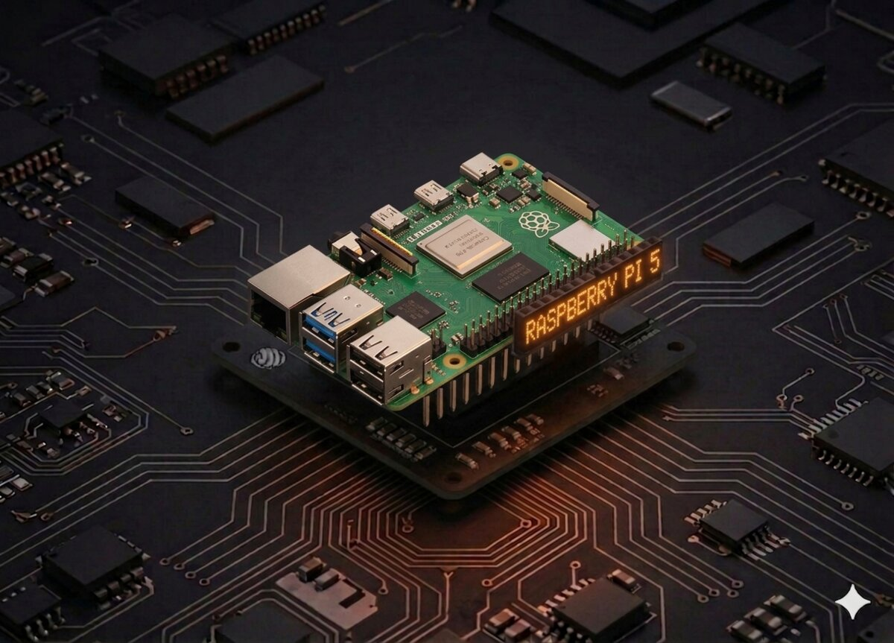

# Proiecte Raspberry Pi

Resurse educaționale pentru dezvoltare pe Raspberry Pi folosind C, MicroPython și Piper Make.

## Căi de dezvoltare

### 1. Dezvoltare în C/C++

Pentru cei interesați de programare la nivel scăzut și performanță.

- [Tutorial pentru utilizatorii Arduino](https://github.com/ursoaia-edu/cerc_de_informatica_2025/tree/main/raspberry_pi/C/Tutorial%20For%20Arduino%20User) - Tranziția de la Arduino la Raspberry Pi în C.

### 2. MicroPython

O modalitate prietenoasă pentru începători de a interacționa cu hardware-ul pe Raspberry Pi Pico și alte plăci.

- [Tutorial pentru utilizatorii MicroPython](https://github.com/ursoaia-edu/cerc_de_informatica_2025/tree/main/raspberry_pi/MicroPython/Tutorial%20For%20MicroPython%20User)
- [Exemple de cod MicroPython](https://github.com/ursoaia-edu/cerc_de_informatica_2025/tree/main/raspberry_pi/MicroPython/MicroPython_Codes)

### 3. Piper Make

O interfață de programare vizuală bazată pe blocuri pentru Raspberry Pi Pico.

- [Resurse Piper Make](https://github.com/ursoaia-edu/cerc_de_informatica_2025/tree/main/raspberry_pi/Piper_Make)

---

## Resurse

- [Documentația Raspberry Pi](https://www.raspberrypi.com/documentation/)
- [MicroPython pentru Raspberry Pi Pico](https://www.raspberrypi.com/documentation/microcontrollers/micropython.html)
